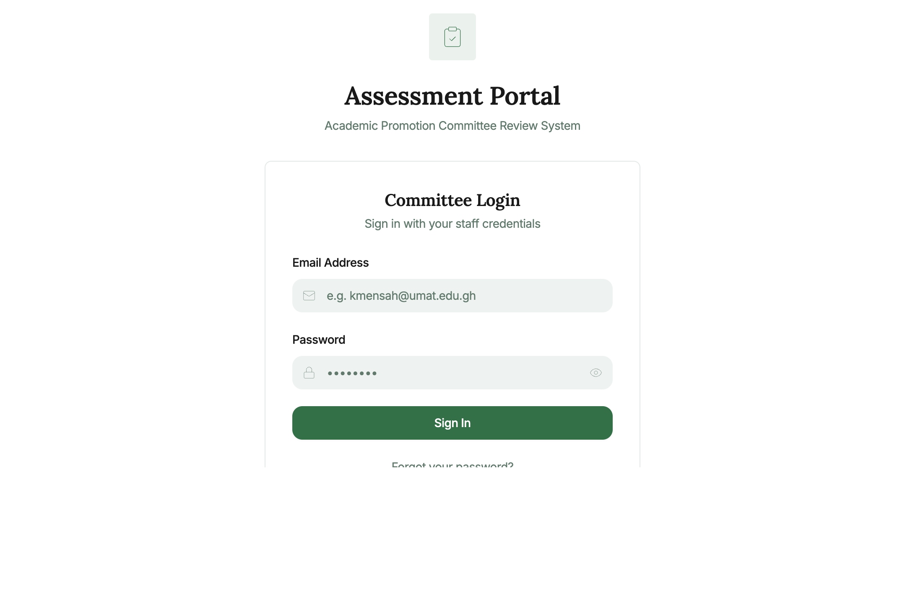
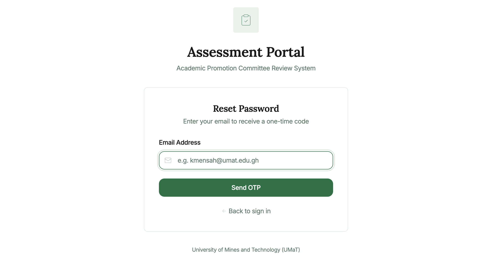
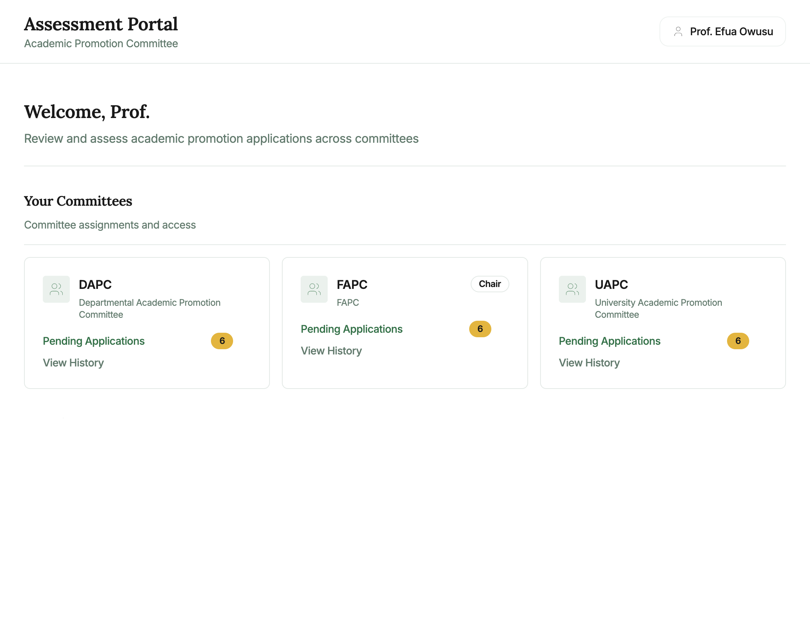
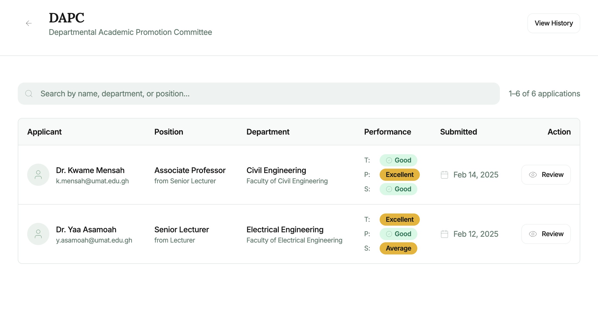
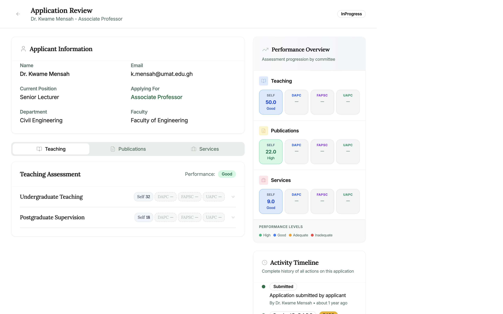
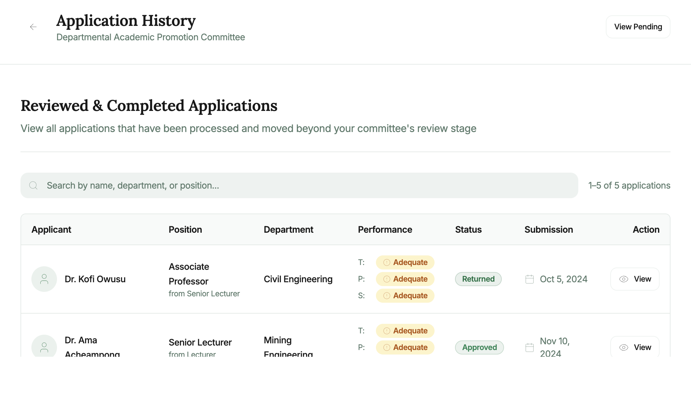
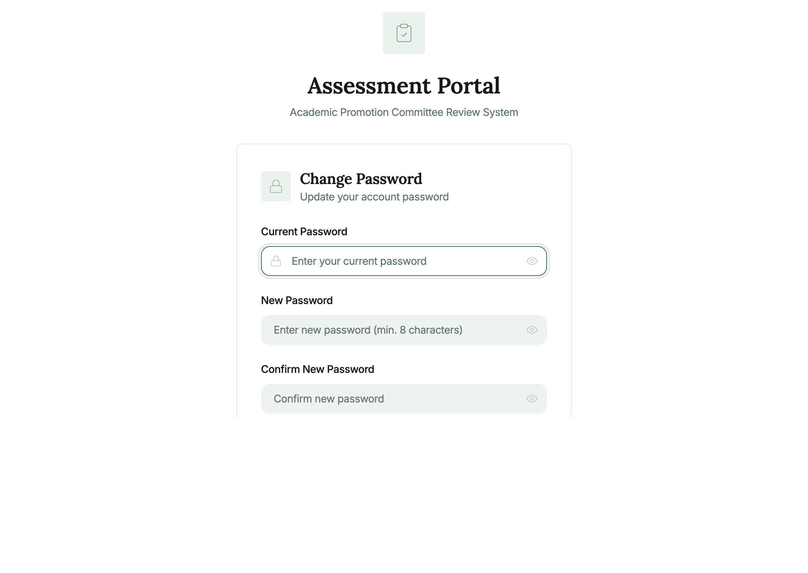

# OSASS Academic Assessment Portal — User Manual

**System:** Online Staff Appointment & Promotion System (OSASS)  
**Portal:** Academic Promotion Assessment Portal  
**Audience:** Academic staff serving on Academic Promotion Assessment Committees (DAPC, FAPC, UAPC)  
**Version:** 1.0 | May 2025

---

## Table of Contents

1. [Overview](#1-overview)
2. [Getting Started](#2-getting-started)
   - [Logging In](#21-logging-in)
   - [Forgot Password](#22-forgot-password)
3. [Dashboard](#3-dashboard)
4. [Pending Applications](#4-pending-applications)
5. [Application Review](#5-application-review)
   - [Applicant Information](#51-applicant-information)
   - [Teaching Assessment Tab](#52-teaching-assessment-tab)
   - [Publications Assessment Tab](#53-publications-assessment-tab)
   - [Services Assessment Tab](#54-services-assessment-tab)
   - [Performance Overview Panel](#55-performance-overview-panel)
   - [Activity Timeline](#56-activity-timeline)
   - [Assessment Actions](#57-assessment-actions)
6. [Application History](#6-application-history)
7. [Account Management](#7-account-management)
   - [Change Password](#71-change-password)
8. [Navigation & Layout](#8-navigation--layout)
9. [Committee Roles & Permissions](#9-committee-roles--permissions)

---

## 1. Overview

The **OSASS Academic Assessment Portal** is the dedicated portal for academic staff who serve as members of Academic Promotion Assessment Committees. These committees review and score promotion applications submitted by academic staff in the Academic Promotion Portal.

The academic promotion review process involves three levels:

| Level | Committee | Abbreviation | Scope |
|-------|-----------|--------------|-------|
| 1 | Departmental Academic Promotions Committee | **DAPC** | Department-level review |
| 2 | Faculty Academic Promotions Committee | **FAPC** | Faculty-level review |
| 3 | University Academic Promotions Committee | **UAPC** | Final university-level review |

A committee member may belong to one or more of these committees (some senior academics serve on multiple levels). The **Chairperson** of each committee has additional powers: submitting reviewed applications to the next level, returning applications to the applicant, approving (UAPC only), or rejecting (UAPC only).

---

## 2. Getting Started

### 2.1 Logging In

**Steps to log in:**

1. Navigate to the Academic Assessment Portal URL.
2. Enter your **Staff Email** (e.g., `e.owusu@umat.edu.gh`).
3. Enter your **Password**.
4. Click **Sign In**.

On successful login, you are directed to your **Dashboard**.

> **Note:** Access to this portal is restricted to staff registered as committee members in the Admin Portal. Contact your department administrator if you should have access but cannot log in.

---

### 2.2 Forgot Password

1. Click **"Forgot password?"** on the login page.
2. Enter your registered email and click **Send OTP**.
3. Check your email inbox for the one-time code.
4. Enter the OTP and set your new password.
5. Click **Back to sign in**.

---

## 3. Dashboard

After login, the **Dashboard** shows **Your Committees** — the committee assignments you have been registered to. Each committee card shows:

| Element | Description |
|---------|-------------|
| **Committee name and abbreviation** | e.g., DAPC, FAPC, UAPC |
| **Full committee title** | e.g., "Departmental Academic Promotion Committee" |
| **Chair badge** | Shown if you are the Chairperson of that committee |
| **Pending Applications** | Link with a count badge showing the number of applications awaiting review |
| **View History** | Link to see applications already reviewed by this committee |

**Typical scenario:** A professor serving on FAPC as Chairperson will see the FAPC card with a "Chair" badge, and can click "Pending Applications" to begin reviewing submitted applications.

---

## 4. Pending Applications

**How to access:** Click **Pending Applications** on any committee card on the Dashboard.

The Pending Applications page lists all promotion applications that have been forwarded to your committee for review. Each row shows:

| Column | Description |
|--------|-------------|
| **Applicant Name** | Full name of the staff member applying for promotion |
| **Current Position** | The applicant's current academic rank |
| **Applying For** | The target promotion position |
| **Department / Faculty** | The applicant's home department and faculty |
| **Submission Date** | When the application was submitted |
| **Status** | Current review status (Pending / In Progress) |
| **Resubmission indicator** | Badge shown if the application was previously returned and resubmitted |

**To search:** Use the search bar at the top to filter by applicant name or staff ID.

**To begin reviewing an application:** Click anywhere on the row to open the **Application Review** page.

---

## 5. Application Review

The **Application Review** page is the core of the assessment process. It shows the applicant's full submitted data and allows you to enter your committee's assessment scores.

### 5.1 Applicant Information

At the top of the review page, a card shows the applicant's basic profile:
- **Name** and **Email**
- **Current Position** and **Applying For** (highlighted in green)
- **Department** and **Faculty**
- **Submission date** and current **Review Status** badge

---

### 5.2 Teaching Assessment Tab

The **Teaching** tab (active by default) shows the applicant's teaching data organized into assessment categories.

**For each teaching category (e.g., Undergraduate Teaching, Postgraduate Supervision):**
- The category name and a collapsed accordion row
- Score badges: **SELF** (applicant's self-score), **DAPC**, **FAPSC**, **UAPC** — showing the score each committee has assigned (shown as "—" if not yet assessed)
- Click the **chevron (›)** icon to expand a category and see the applicant's remarks

**If you are a committee member with assessment rights:**
- Expand a category row to reveal a **Score Input Panel** for your committee level
- Enter your numeric **score** in the input field (the max score is indicated)
- Add optional **remarks** about your assessment
- Click **Save Score** (or the scores are saved when you submit)

---

### 5.3 Publications Assessment Tab

Click the **Publications** tab to review the applicant's publications list.

**For each publication:**
- Title, year, and publication type
- **System-Generated Score** (automatically computed based on the publication type's configured score)
- Score badges for each committee level (SELF, DAPC, FAPC, UAPC)
- Expand a publication row to enter your committee's score and remarks

---

### 5.4 Services Assessment Tab

Click the **Services** tab to review the applicant's service records.

**For each service record:**
- Service title, role, and duration
- System-generated score
- Committee score badges
- Expand to enter your committee's assessment

---

### 5.5 Performance Overview Panel

On the **right side** of the review page, the **Performance Overview** panel provides a visual summary of scores across all categories:

| Section | Shows |
|---------|-------|
| **Teaching** | SELF, DAPC, FAPC, UAPC score totals with performance level labels (High / Good / Adequate / Inadequate) |
| **Publications** | Same format for publication scores |
| **Services** | Same format for service scores |

The **Performance Levels** legend at the bottom defines the colour coding:
- 🟢 **High** — Scores in the top performance range
- 🔵 **Good** — Scores in the second range
- 🟡 **Adequate** — Scores meeting minimum requirements
- 🔴 **Inadequate** — Scores below minimum requirements

---

### 5.6 Activity Timeline

Scroll down on the right panel to see the **Activity Timeline** — a chronological log of all actions taken on this application:
- When the application was submitted
- When it was received by each committee
- Any previous returns, resubmissions, or score entries

---

### 5.7 Assessment Actions

**For committee members (non-chairperson):**
- **Save Scores** — Save your entered scores and remarks without finalising

**For chairpersons (additional actions):**

| Action | Description |
|--------|-------------|
| **Save Scores** | Save the committee's scored assessment |
| **Return to Applicant** | Send the application back with a reason (applicant can correct and resubmit) |
| **Advance to Next Committee** | Forward the application to the next review level (DAPC → FAPC → UAPC) |
| **Approve** (UAPC only) | Approve the application for promotion |
| **Reject** (UAPC only) | Reject the application with a reason |

**When advancing an application:**
1. Click **"Advance to Next Committee"**.
2. An **Add Recommendation** dialog opens. Enter your overall recommendation remarks.
3. Click **Confirm** to advance the application.

**When returning an application:**
1. Click **"Return to Applicant"**.
2. Enter the **reason** for return and specific **details** about what corrections are needed.
3. Click **Confirm Return**.

---

## 6. Application History

**How to access:** Click **View History** on any committee card on the Dashboard.

The **Application History** page shows all applications that have been reviewed and passed through (or completed at) this committee level. Use it to review past decisions and track promotion outcomes.

**Table columns:** Applicant Name, Position Applied For, Status (Approved / Rejected / Advanced / Returned), Review Date, Score Summary.

---

## 7. Account Management

### 7.1 Change Password

**How to access:** Click the user icon in the top right corner and select **Change Password**, or navigate to `/change-password`.

1. Enter your **Current Password**.
2. Enter and confirm your **New Password**.
3. Click **Update Password**.

---

## 8. Navigation & Layout

The Academic Assessment Portal has a minimal **top-navigation** layout (no sidebar):

### Top Header Bar
- **"Assessment Portal"** title and subtitle **"Academic Promotion Committee"** on the left
- **Your name** (e.g., *Prof. Efua Owusu*) displayed in the top right, with a user icon

### Page Navigation
- **Back arrow** (←) on the review and pending applications pages to return to the previous screen
- **Dashboard** is the home page (accessible by clicking the portal name or navigating to `/`)

---

## 9. Committee Roles & Permissions

| Permission | Committee Member | Chairperson |
|------------|-----------------|-------------|
| View pending applications | ✅ | ✅ |
| View application review details | ✅ | ✅ |
| Enter assessment scores | ✅ | ✅ |
| Save score drafts | ✅ | ✅ |
| Return application to applicant | ❌ | ✅ |
| Advance application to next level | ❌ | ✅ |
| Approve application (UAPC) | ❌ | ✅ |
| Reject application (UAPC) | ❌ | ✅ |
| View application history | ✅ | ✅ |

---

*For technical support: `support@umat.edu.gh`*  
*For committee assignment queries, contact the Academic Promotion Office.*

---

*Document generated: May 2025 | OSASS v2*
