# OSASS Academic Promotion Portal — User Manual

**System:** Online Staff Appointment & Promotion System (OSASS)  
**Portal:** Academic Promotion Portal  
**Audience:** Academic Staff of the University of Mines and Technology (UMaT), Tarkwa  
**Version:** 1.0 | May 2025

---

## Table of Contents

1. [Overview](#1-overview)
2. [Getting Started](#2-getting-started)
   - [Landing Page](#21-landing-page)
   - [Logging In](#22-logging-in)
   - [Forgot Password](#23-forgot-password)
3. [Dashboard](#3-dashboard)
4. [Eligibility Check](#4-eligibility-check)
5. [Promotion Forecast](#5-promotion-forecast)
6. [Promotion Application](#6-promotion-application)
   - [Application Overview](#61-application-overview)
   - [Teaching Section](#62-teaching-section)
   - [Publications Section](#63-publications-section)
   - [Service Section](#64-service-section)
   - [Review & Submit](#65-review--submit)
   - [View Submitted Application](#66-view-submitted-application)
7. [Application Progress Tracking](#7-application-progress-tracking)
8. [Promotion History](#8-promotion-history)
9. [Promotion Letter](#9-promotion-letter)
10. [Staff Updates](#10-staff-updates)
11. [Resources](#11-resources)
    - [Promotion Guidelines](#111-promotion-guidelines)
    - [Score Guide](#112-score-guide)
    - [User Guide](#113-user-guide)
12. [Account Management](#12-account-management)
    - [Settings](#121-settings)
    - [Change Password](#122-change-password)
13. [Navigation & Layout](#13-navigation--layout)

---

## 1. Overview

The **OSASS Academic Promotion Portal** is a dedicated web application for UMaT academic staff to manage their entire promotion journey from eligibility verification through application submission to tracking the review outcome. The portal streamlines the academic promotion process by providing a single digital platform that replaces paper-based workflows.

**Key capabilities:**
- Check promotion eligibility in real time
- Plan a career path with the Promotion Forecast tool
- Build and submit a promotion application with supporting documents across three scored categories: Teaching, Publications, and Service
- Track the review progress of a submitted application
- Download your official promotion letter upon approval
- Access official guidelines, score rubrics, and staff announcements

---

## 2. Getting Started

### 2.1 Landing Page

When you first visit the portal URL, you are greeted by the **OSASS landing page**. This is the public-facing homepage that introduces the system before you log in.

**What you see:**
- The **UMaT OSASS** logo and tagline *"PROMOTION & APPOINTMENT"*
- The headline *"Every UMaT staff promotion journey, one place."*
- A description of OSASS as the Online Staff Appointment & Promotion System
- A hamburger menu in the top-right corner to access sign-in and information links

**Next step:** Click the menu icon or navigate to `/login` to access the sign-in page.

---

### 2.2 Logging In

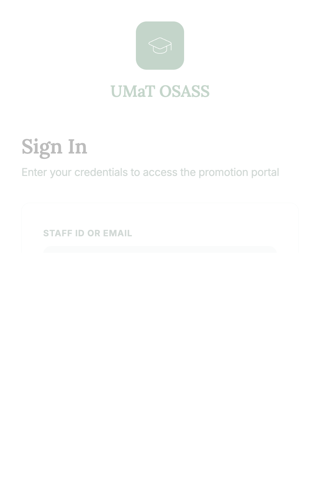

**Steps to log in:**

1. Navigate to the portal URL. You will be directed to the **Sign In** page.
2. Enter your **Staff ID or Email** (e.g., `kmensah@umat.edu.gh`).
3. Enter your **Password**.
4. Click the **Sign In** button.

On a successful login, you will be redirected to the **Dashboard**.

> **Note:** If you have not yet received your login credentials, contact the Academic Promotion Office or the IT Support desk at `support@umat.edu.gh`.

---

### 2.3 Forgot Password

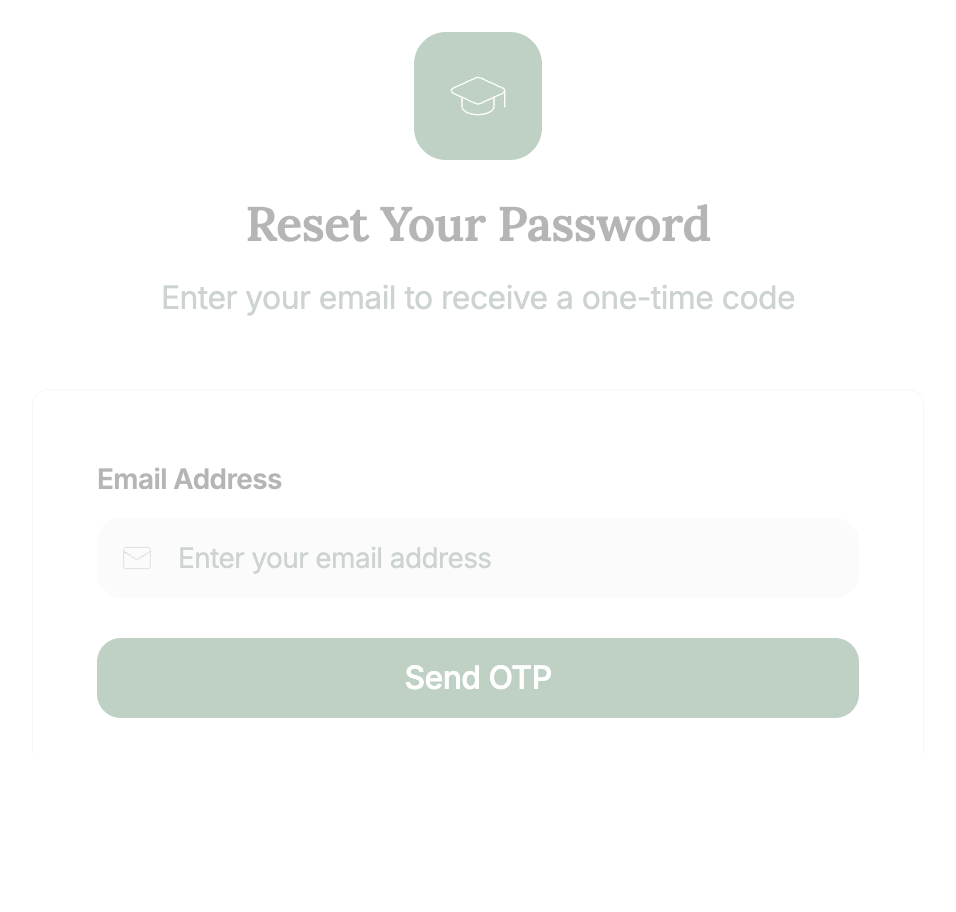

If you cannot remember your password:

1. Click **"Forgot password?"** on the login page.
2. On the **Reset Your Password** screen, enter your registered **Email Address**.
3. Click **Send OTP**.
4. Check your email inbox for a one-time code (OTP).
5. Enter the OTP and your new password when prompted.
6. Click **Back to sign in** once the password has been reset.

---

## 3. Dashboard

The **Dashboard** is your central hub after signing in. It provides an at-a-glance summary of your promotion application status and gives you quick access to all major features.

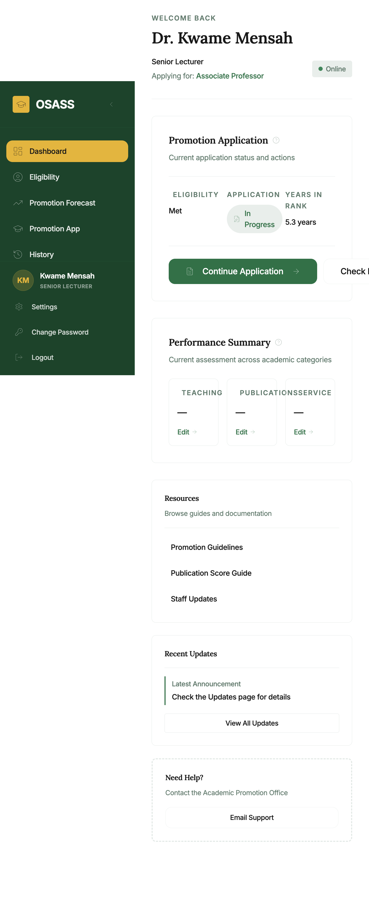

**Dashboard sections:**

| Section | Description |
|---------|-------------|
| **Welcome Back** | Displays your name, current academic rank, and the position you are applying for |
| **Promotion Application card** | Shows your current eligibility status, application status badge, and years in rank. Provides a primary action button (Start / Continue Application, View Status, or View Letter depending on state) |
| **Performance Summary card** | Displays your current scores across Teaching, Publications, and Service with quick "Edit" links to each section |
| **Resources panel** | Quick links to Promotion Guidelines, Publication Score Guide, and Staff Updates |
| **Recent Updates** | A preview of the latest staff announcement with a link to view all updates |
| **Need Help?** | Contact information for the Academic Promotion Office |

**First-time onboarding:** On your very first login, a **Welcome to OSASS** banner appears explaining the three main actions: Check Eligibility, Submit Application, and Forecast Career Path. Click **"Got it, let me explore"** to dismiss it.

---

## 4. Eligibility Check

Before starting an application, always verify your eligibility status on the **Promotion Eligibility Assessment** page.

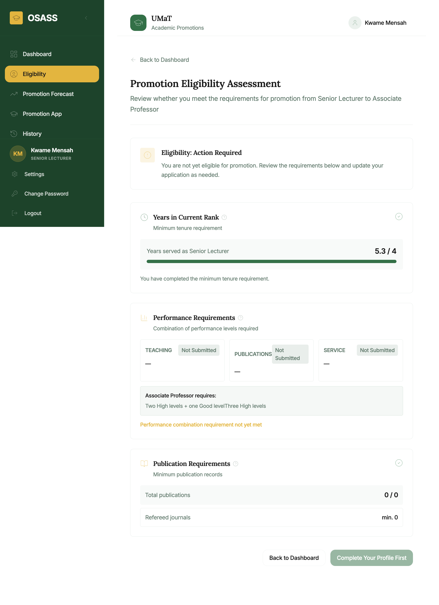

**How to access:** Click **Eligibility** in the left sidebar.

**What the page shows:**

| Section | Description |
|---------|-------------|
| **Overall status banner** | Green (Eligible) or Amber (Action Required) banner with a summary message |
| **Years in Current Rank** | Progress bar showing years served vs. the minimum required. For example, *5.3 / 4* means 5.3 years served against a 4-year minimum — requirement **met** |
| **Performance Requirements** | Shows the submitted performance levels for Teaching, Publications, and Service. Indicates whether the required combination (e.g., *Two High levels + one Good level*) has been achieved |
| **Publication Requirements** | Displays your total publications count and the minimum refereed journal requirement |

**Eligibility actions:**
- If **Eligible**: A **"Continue Application"** button will appear on the dashboard and a link to go directly to the application.
- If **Not Eligible**: Review the specific criteria not yet met. The "Complete Your Profile First" button guides you to submit your data before eligibility can be confirmed.

> **Tip:** Navigate to the **Eligibility Guidance** page (accessible from the eligibility results) for detailed explanations of each requirement and tips on how to meet them.

---

## 5. Promotion Forecast

The **Promotion Forecast** tool gives you a forward-looking view of your entire career promotion path — from your current rank all the way to the highest academic position.

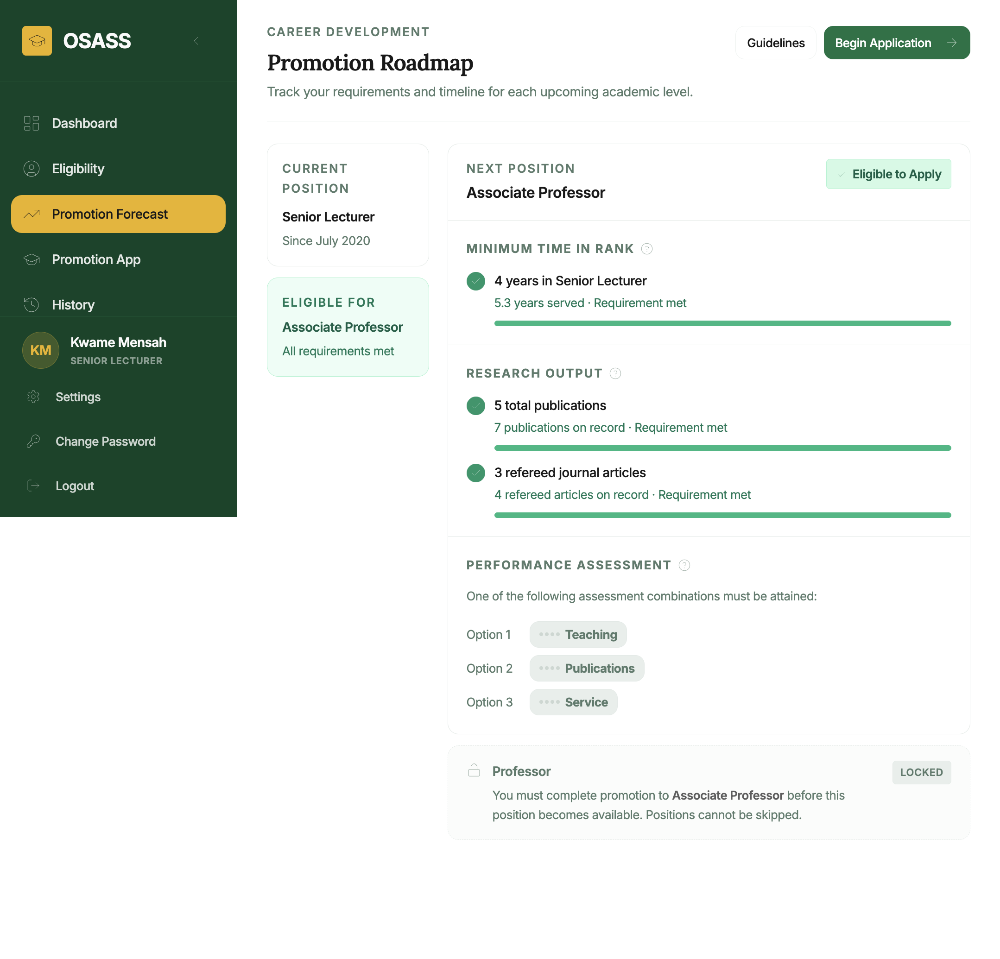

**How to access:** Click **Promotion Forecast** in the left sidebar.

**What the page shows:**

- Your **current position** and date of last promotion
- For each milestone on your promotion ladder:
  - **Target position** and whether you are currently eligible to apply
  - Minimum years required vs. years served (e.g., 4 years required, 5.3 years served → **Eligible**)
  - Estimated eligibility date for future milestones (if currently locked)
  - **Publication requirements**: minimum total publications and refereed journal counts
  - **Required actions**: a prioritised checklist of steps to complete (e.g., *"Add 1 more refereed journal article"*, *"Document all service roles"*)
  - A visual timeline showing each promotion step

**Locked milestones:** Future positions are shown as locked if you must first be promoted to an intermediate position. They display the estimated year you will become eligible.

---

## 6. Promotion Application

The promotion application is divided into three scored sections. You can work on them in any order and save progress at any time.

### 6.1 Application Overview

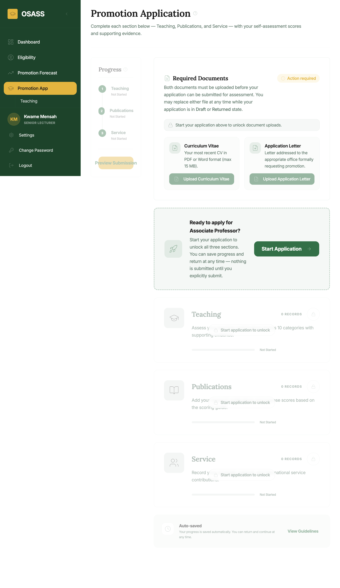

**How to access:** Click **Promotion App** in the sidebar, or click **"Continue Application"** on the dashboard.

The overview page shows the three application categories as cards:

| Category | Max Score | Description |
|----------|-----------|-------------|
| **Teaching** | 70 | Undergraduate & postgraduate teaching load, supervision, and course documentation |
| **Publications** | 40 | Journal articles, conference papers, book chapters, and other publication types |
| **Service** | 30 | Administrative service roles held within UMaT |

Each card shows the current status (Not Started / In Progress / Completed) and the score achieved so far. Click any category card to open that section.

---

### 6.2 Teaching Section

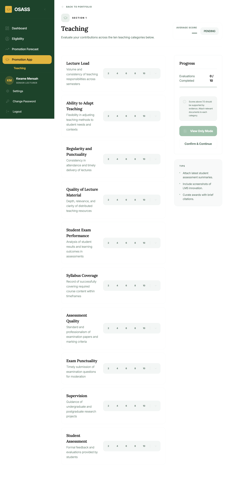

**How to access:** Click the **Teaching** card on the application overview, or navigate via **Promotion App → Teaching** in the sidebar.

**What to do in this section:**
1. **Add courses** taught during the assessment period. For each course, enter:
   - Course code and name
   - Level (100–800)
   - Credit hours
   - Semester and academic year
2. **Upload the teaching schedule document** (required) — typically your official teaching load report or timetable.
3. Click **Save** after each entry.
4. When all courses are entered, click **Mark as Complete**.

The system calculates your Teaching score automatically based on total contact hours and the number of courses.

---

### 6.3 Publications Section

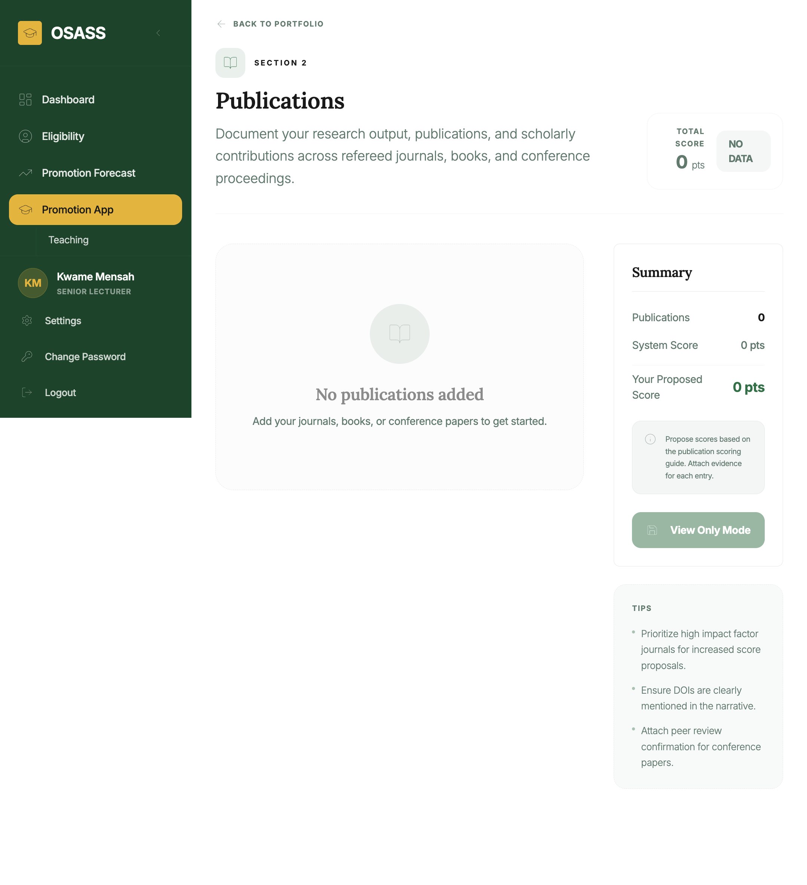

**How to access:** Click the **Publications** card or navigate via **Promotion App → Publications**.

**What to do in this section:**
1. **Add each publication**. For each item, provide:
   - Title of publication
   - Authors (your name must be included)
   - Journal / Conference name
   - Year of publication
   - Publication type (selected from the configured indicator list, e.g., *Scopus-Indexed Journal Article*, *Conference Proceedings*)
2. **Upload the publications document** — a single PDF compiling evidence of all listed publications.
3. Click **Save** after each entry.

Each publication type carries a pre-defined score (set by the Academic Board in the Admin Portal). The section score is the sum of all publication scores.

---

### 6.4 Service Section

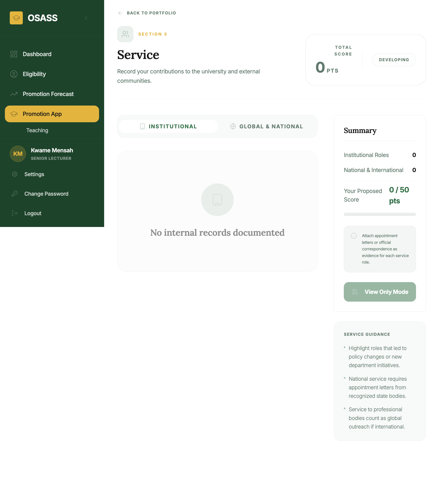

**How to access:** Click the **Service** card or navigate via **Promotion App → Service**.

**What to do in this section:**
1. **Add service positions** held during the assessment period. For each:
   - Select the position type from the dropdown (e.g., *Head of Department*, *Senate Member*)
   - Enter the period (start and end dates)
   - Add any remarks
2. **Upload the service document** if required.
3. Click **Save** and then **Mark as Complete** when done.

---

### 6.5 Review & Submit

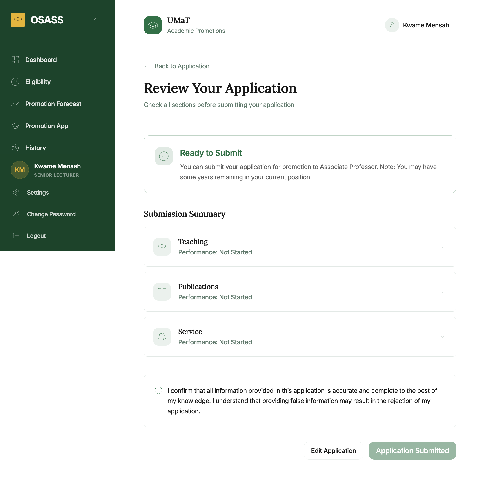

**How to access:** Once all three sections show a status of **Completed** or after filling in your entries, navigate to the **Review** page from the sidebar or the application overview.

**What the Review page shows:**
- A consolidated summary of all three sections — scores, completion status, and entry counts
- An overall score tally with the pass/fail threshold clearly indicated
- A checklist confirming all required documents have been uploaded

**Submitting your application:**
1. Review all information carefully. You **cannot edit** the application after submission.
2. If satisfied, click **Submit Application**.
3. Confirm the submission in the confirmation dialog.
4. You will be redirected to the **Confirmation** page upon successful submission.

> **Important:** Ensure all three sections are complete and all required documents are uploaded before submitting. Missing documents will prevent submission.

---

### 6.6 View Submitted Application

After submission, you can view a **read-only preview** of your submitted application at any time.

**How to access:** Navigate to **Promotion App → View Application** or click the "View Submitted Application" link on the progress page.

This page shows a structured summary of all the data you submitted, including scores per section, document upload status, and submission date and time.

---

## 7. Application Progress Tracking

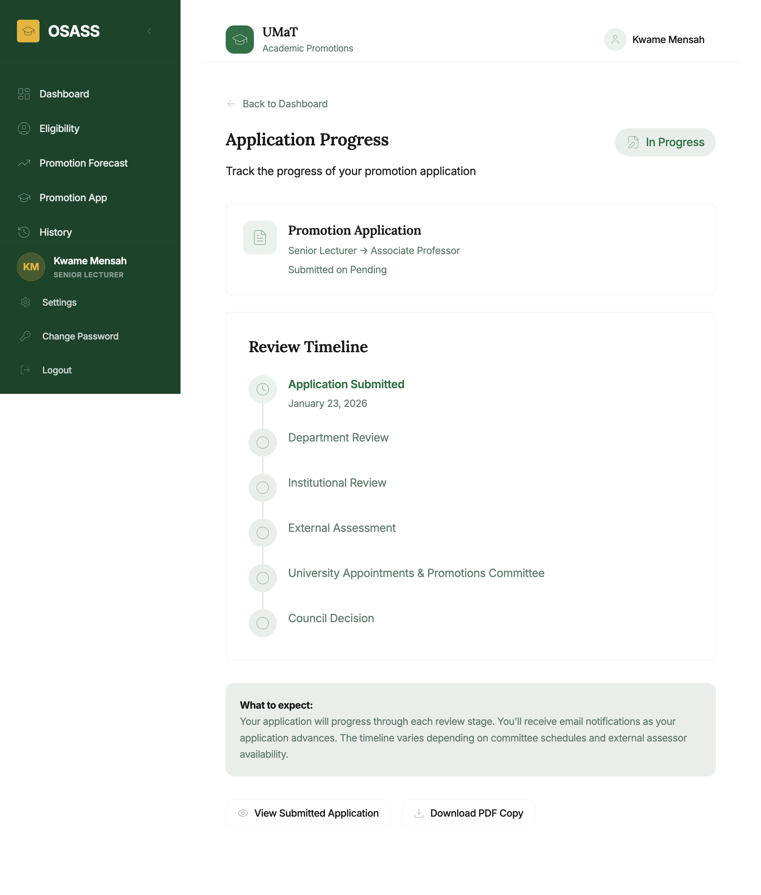

**How to access:** Click the **"View Application Status"** button on the dashboard (visible only after submission), or navigate to `/progress`.

The **Application Progress** page shows the full review pipeline your submitted application passes through:

| Stage | Description |
|-------|-------------|
| **Submitted** | Application received by the system |
| **Under Review (DAPC)** | Department Academic Promotions Committee is reviewing |
| **Under Review (FAPC)** | Faculty Academic Promotions Committee is reviewing |
| **Under Review (UAPC)** | University Academic Promotions Committee is reviewing |
| **Approved / Rejected / Returned** | Final decision made |

A visual timeline highlights the current stage. If the application is **Returned** for corrections, notes from the committee will be displayed and you will be able to resubmit.

---

## 8. Promotion History

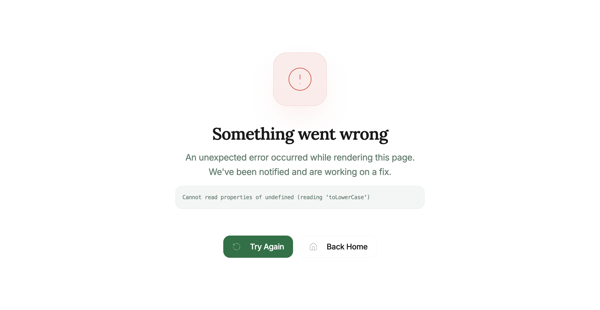

**How to access:** Click **History** in the left sidebar.

The **Promotion History** page lists all your past promotion applications with details including:
- Year of application
- From position → To position
- Application status (Approved / Rejected / Returned)
- Date submitted and date of decision
- Total score achieved

This page is useful for reviewing past performance and understanding score patterns across promotion cycles.

---

## 9. Promotion Letter

**How to access:** Click **Promotion Letter** in the sidebar, or click **"View Promotion Letter"** on the dashboard (available only after your application is approved).

The promotion letter page displays your official **letter of promotion** from the Vice-Chancellor, showing:
- Your full name and staff ID
- Promotion from and to position
- Effective date of promotion
- Reference number of the letter
- Approving authority

You can **print** or **download** the letter as a PDF using the action buttons on the page.

---

## 10. Staff Updates

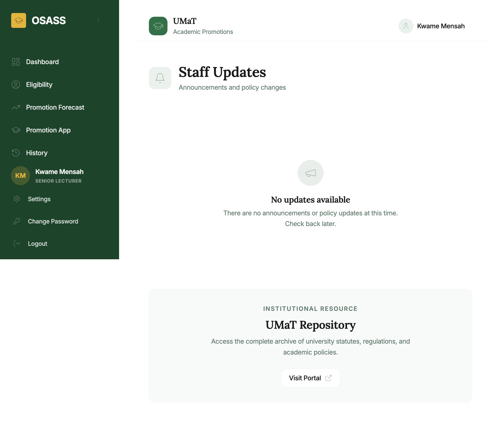

**How to access:** Click **Updates** in the resources section or via the direct sidebar link.

The **Staff Updates** page shows announcements and notices from the Academic Promotion Office. Each update shows:
- Title and category (Announcement, Policy, Technical)
- Publication date
- Full content

Use the **search bar** to filter updates by keyword. Updates are paginated — use the navigation at the bottom to browse older entries.

---

## 11. Resources

### 11.1 Promotion Guidelines

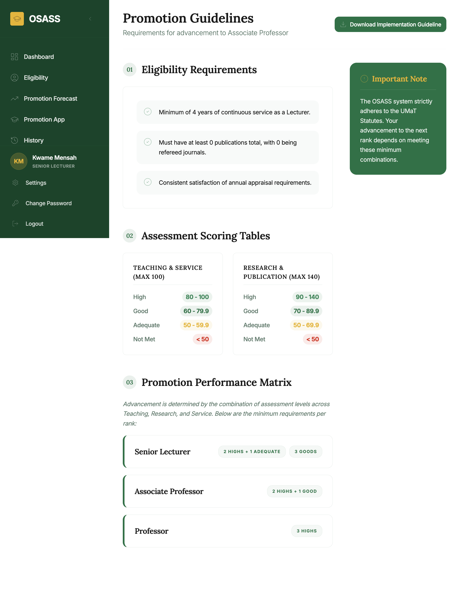

The **Promotion Guidelines** page presents the official UMaT academic promotion criteria in a structured, easy-to-read format. It explains the criteria for each promotion level, the scoring methodology, and the required documentation.

### 11.2 Score Guide

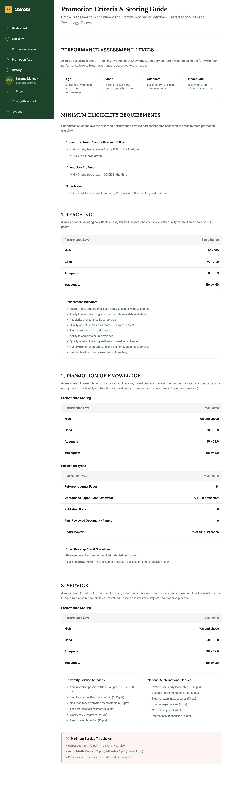

The **Score Guide** provides a detailed reference table of:
- Publication type indicators and their point values
- Service position types and their point values
- Teaching load score calculation methodology

Use this guide to understand exactly how your application score will be computed before submitting.

### 11.3 User Guide

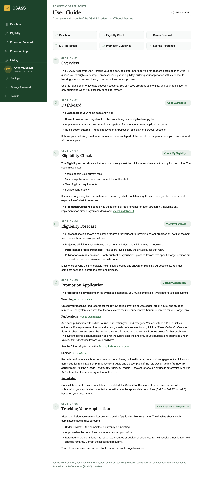

The built-in **User Guide** is a step-by-step visual walkthrough of how to use the OSASS portal, tailored for first-time users.

---

## 12. Account Management

### 12.1 Settings

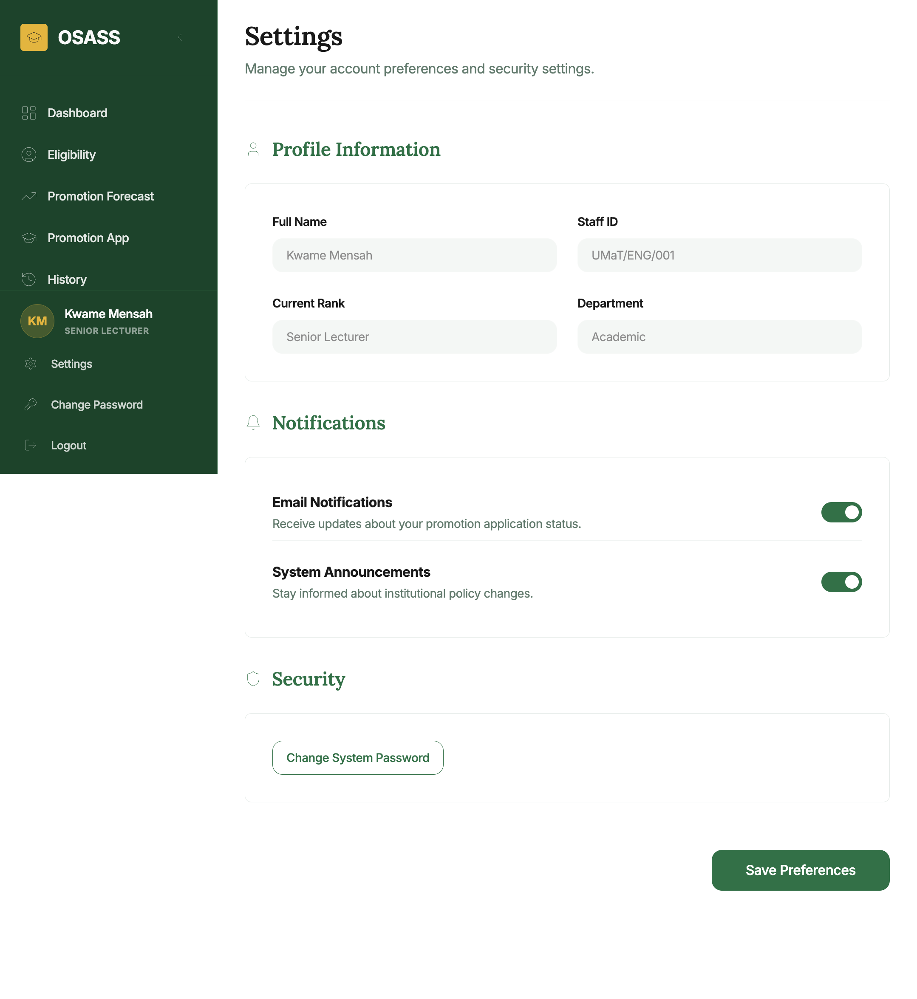

**How to access:** Click **Settings** in the sidebar footer.

The Settings page allows you to update your display preferences, including:
- **Theme** — switch between Light and Dark mode
- Profile display options

### 12.2 Change Password

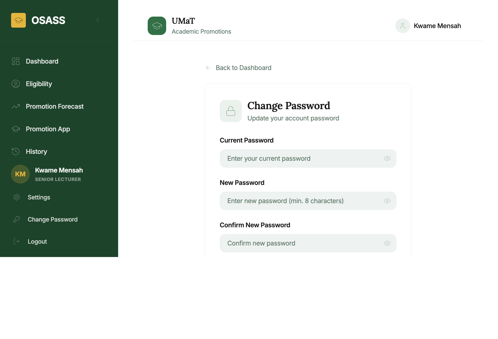

**How to access:** Click **Change Password** in the sidebar footer.

**Steps:**
1. Enter your **Current Password**.
2. Enter your **New Password** (minimum 8 characters).
3. Confirm the new password in the **Confirm New Password** field.
4. Click **Update Password**.

---

## 13. Navigation & Layout

The portal uses a consistent two-panel layout throughout all authenticated pages:

### Left Sidebar

| Item | Description |
|------|-------------|
| OSASS logo + collapse toggle | Click the `<` arrow to collapse the sidebar to icon-only view to gain more screen space |
| **Dashboard** | Home overview |
| **Eligibility** | Promotion eligibility assessment |
| **Promotion Forecast** | Career path forecast tool |
| **Promotion App** | Application sections (Teaching, Publications, Service) |
| **History** | Past promotion records |
| User profile card | Your name and rank displayed at the bottom |
| **Settings** | Display and preference settings |
| **Change Password** | Password update |
| **Logout** | Securely sign out |

### Top Header Bar

- **Portal identifier** (UMaT logo + "Academic Promotions")
- **Your name** displayed on the right

### Keyboard Shortcuts
- **F8** — Open notification center
- **Alt+T** — Toggle notification area

---

*For technical support, contact: `support@umat.edu.gh`*  
*For promotion queries, contact the Academic Promotion Office.*

---

*Document generated: May 2025 | OSASS v2*
