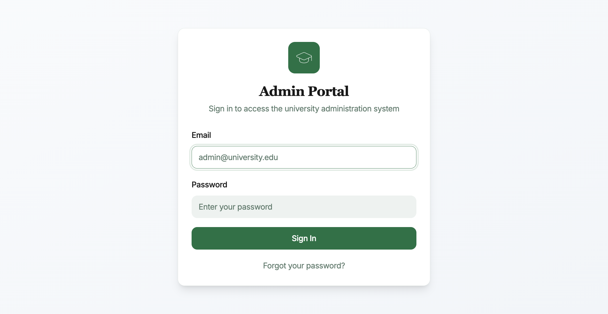
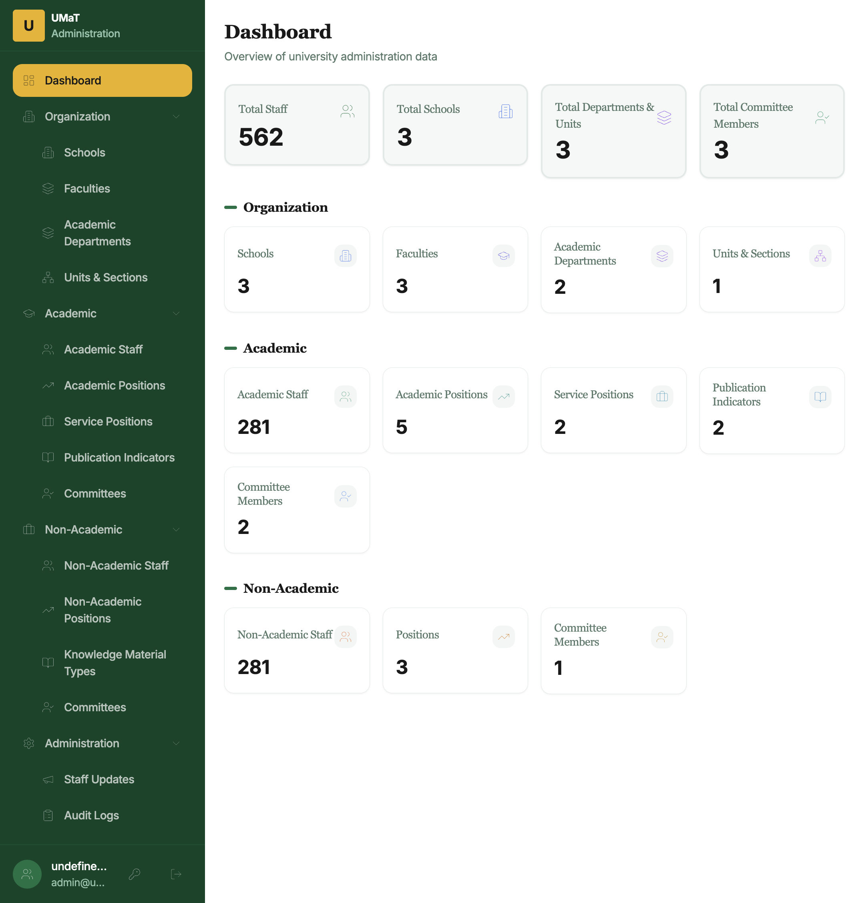
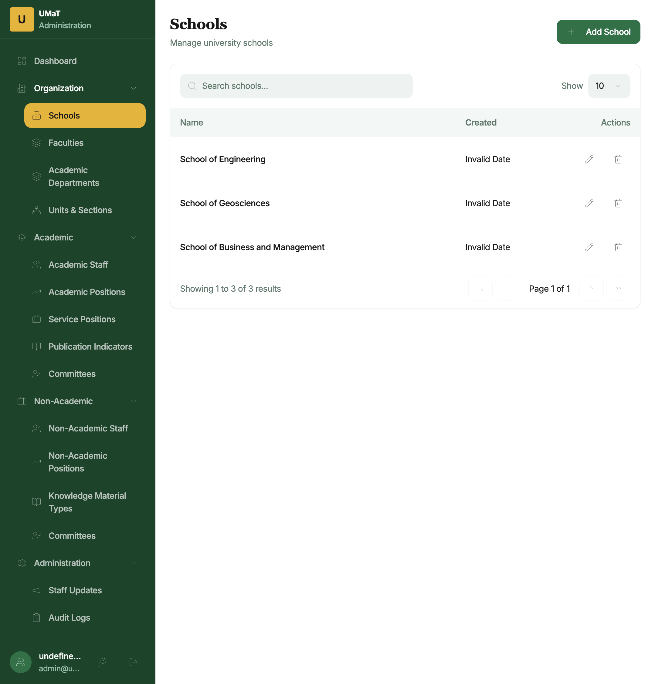
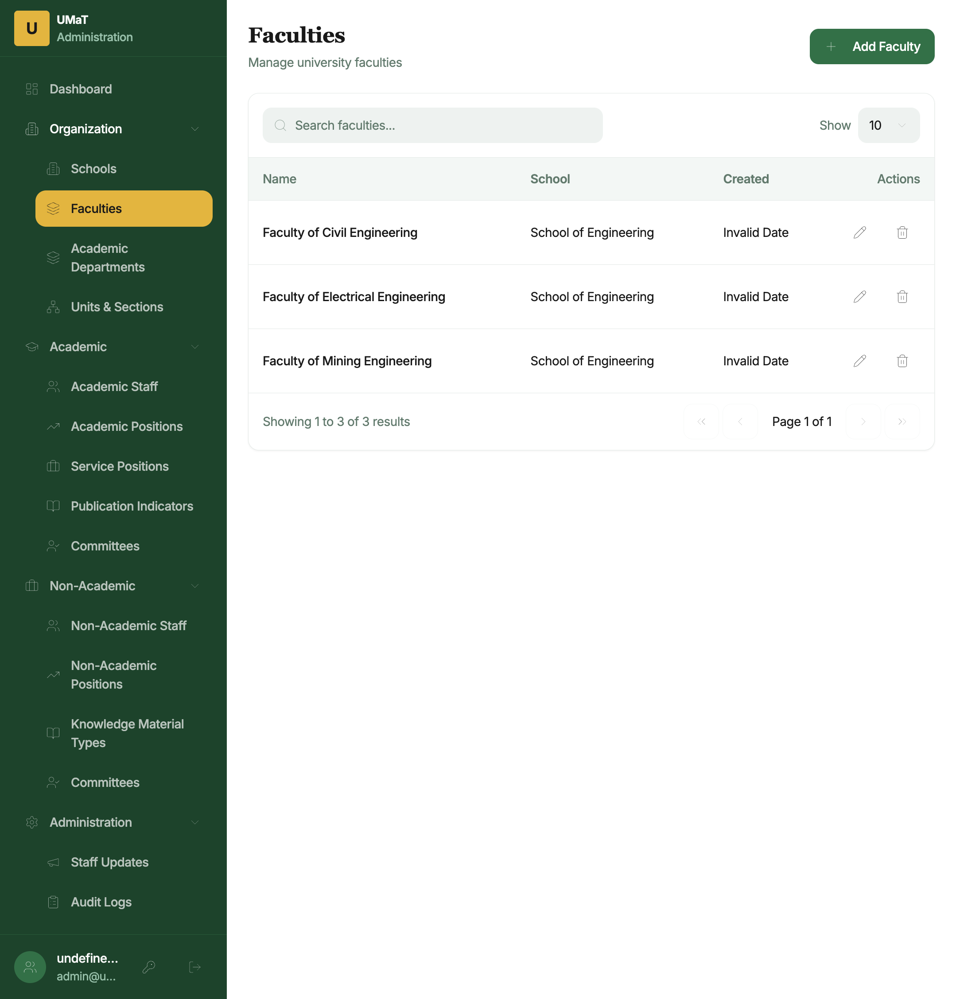
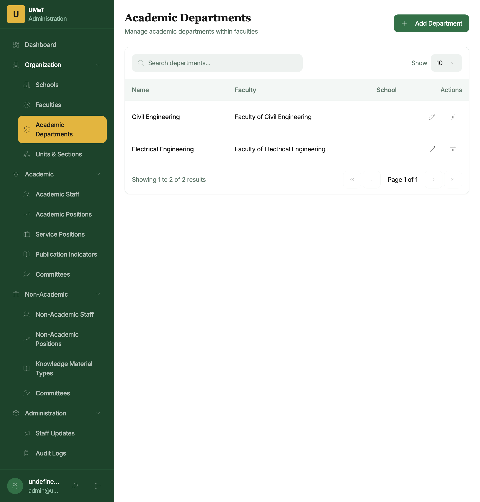
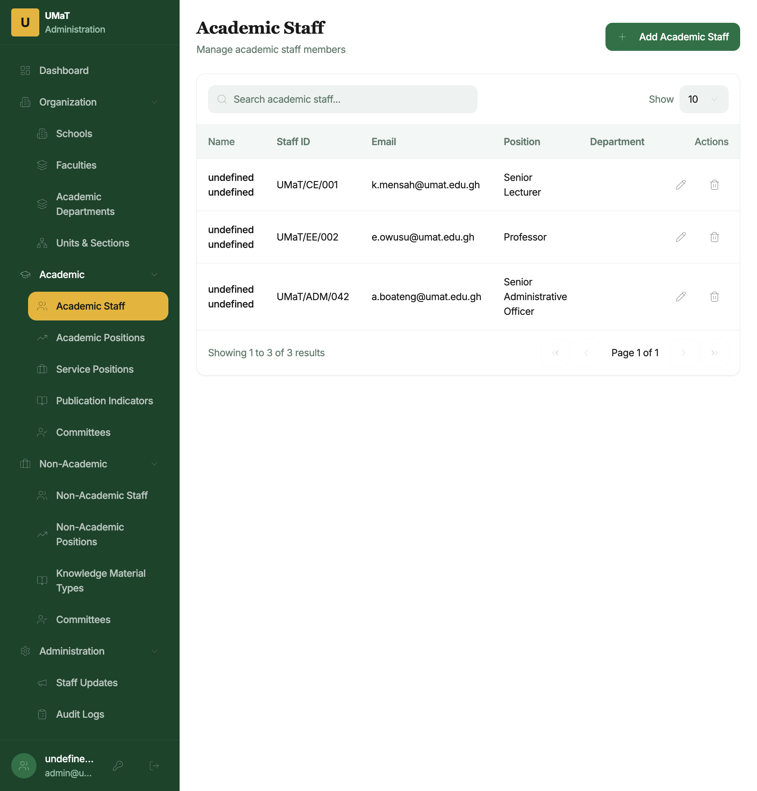
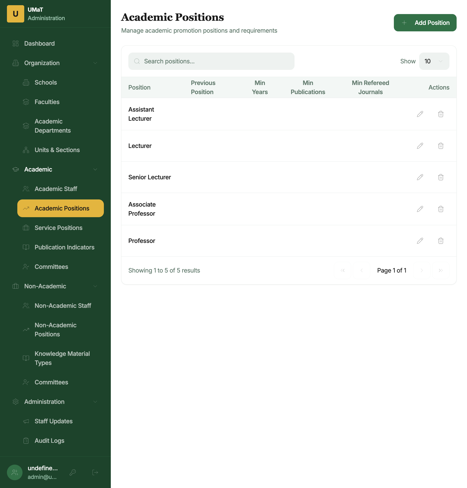
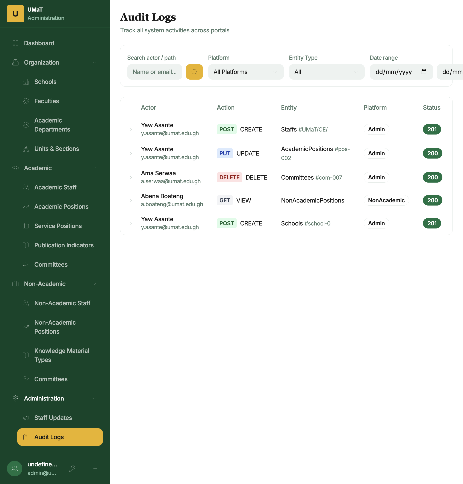
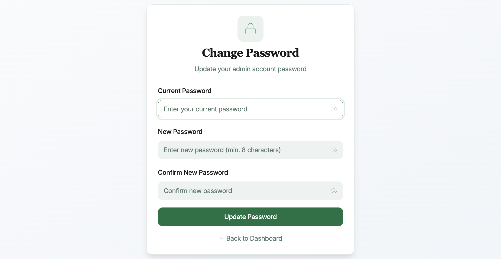

# OSASS Administration Portal — User Manual

**System:** Online Staff Appointment & Promotion System (OSASS)  
**Portal:** Administration Portal  
**Audience:** University Administrators (Admin and SuperAdmin roles) at the University of Mines and Technology (UMaT), Tarkwa  
**Version:** 1.0 | May 2025

---

## Table of Contents

1. [Overview](#1-overview)
2. [Getting Started](#2-getting-started)
   - [Logging In](#21-logging-in)
3. [Dashboard](#3-dashboard)
4. [Organization Management](#4-organization-management)
   - [Schools](#41-schools)
   - [Faculties](#42-faculties)
   - [Academic Departments](#43-academic-departments)
   - [Units & Sections](#44-units--sections)
5. [Academic Management](#5-academic-management)
   - [Academic Staff](#51-academic-staff)
   - [Academic Positions](#52-academic-positions)
   - [Service Positions](#53-service-positions)
   - [Publication Indicators](#54-publication-indicators)
   - [Academic Committees](#55-academic-committees)
6. [Non-Academic Management](#6-non-academic-management)
   - [Non-Academic Staff](#61-non-academic-staff)
   - [Non-Academic Positions](#62-non-academic-positions)
   - [Knowledge Material Types](#63-knowledge-material-types)
   - [Non-Academic Committees](#64-non-academic-committees)
7. [Administration](#7-administration)
   - [Staff Updates](#71-staff-updates)
   - [Audit Logs](#72-audit-logs)
   - [Administrators (SuperAdmin Only)](#73-administrators-superadmin-only)
8. [Account Management](#8-account-management)
   - [Change Password](#81-change-password)
9. [Navigation & Layout](#9-navigation--layout)
10. [Role Permissions Reference](#10-role-permissions-reference)

---

## 1. Overview

The **OSASS Administration Portal** is the backend management system for university administrators. It provides full control over the organisational structure, staff records, promotion criteria, and the promotion assessment committees that drive both the Academic and Non-Academic promotion portals.

**Key capabilities:**
- Manage the university's organisational hierarchy (Schools → Faculties → Departments / Units)
- Register and manage academic and non-academic staff members
- Define promotion position levels and their eligibility criteria
- Configure publication indicators and scoring weights for academic promotions
- Configure knowledge material types and scoring for non-academic promotions
- Manage service position types used in all promotion applications
- Create and manage promotion assessment committees (DAPC, FAPC, UAPC for academic; Institutional, University for non-academic)
- Publish staff update announcements to both staff portals
- Review system activity via the Audit Logs

**User roles:**
- **Admin** — Full access to all sections except the Administrators management page
- **SuperAdmin** — Full access including managing other administrator accounts

---

## 2. Getting Started

### 2.1 Logging In

**Steps to log in:**

1. Navigate to the Administration Portal URL.
2. Enter your **Admin Email** (e.g., `y.asante@umat.edu.gh`).
3. Enter your **Password**.
4. Click **Sign In**.

Successful login redirects you to the **Dashboard**.

> **Security note:** The Administration Portal is restricted to authorised administrator accounts only. Do not share your credentials. Contact the IT department if you suspect unauthorised access.

---

## 3. Dashboard

The **Dashboard** provides a summary of the university's current OSASS data at a glance.

**Dashboard stat cards:**

| Card | Description |
|------|-------------|
| **Total Staff** | Combined total of registered academic and non-academic staff |
| **Schools** | Number of schools configured in the system |
| **Departments/Units** | Total academic departments and non-academic units/sections |
| **Committee Members** | Total active committee members across all committees |

The dashboard also shows a quick navigation panel to the most frequently used management sections.

---

## 4. Organization Management

The **Organization** section allows you to build and maintain the university's hierarchical structure. All other records (staff, committees, etc.) are linked to this structure.

### 4.1 Schools

**How to access:** Click **Organization → Schools** in the sidebar.

The Schools page lists all registered schools at UMaT. Each row shows the school name and action buttons.

**To add a school:**
1. Click **+ Add School**.
2. Enter the **School Name** (e.g., *School of Mines and Technology*).
3. Click **Save**.

**To edit a school:** Click the pencil (✏) icon in the Actions column, update the name, and click **Save**.

**To delete a school:** Click the trash (🗑) icon. A confirmation dialog appears. Note that a school can only be deleted if no faculties are linked to it.

---

### 4.2 Faculties

**How to access:** Click **Organization → Faculties**.

Lists all faculties with their parent School name.

**To add a faculty:**
1. Click **+ Add Faculty**.
2. Enter the **Faculty Name** and select the **School** it belongs to.
3. Click **Save**.

---

### 4.3 Academic Departments

**How to access:** Click **Organization → Academic Departments**.

Lists all academic departments with their parent Faculty.

**To add a department:**
1. Click **+ Add Department**.
2. Enter the **Department Name** and select the **Faculty**.
3. Click **Save**.

---

### 4.4 Units & Sections

**How to access:** Click **Organization → Units & Sections**.

Manages non-academic units and sections (e.g., *Registry*, *Finance Department*, *Security Unit*). These are used for assigning non-academic staff to their organisational unit.

**To add a unit/section:** Click **+ Add Unit**, enter the name and its parent group, and save.

---

## 5. Academic Management

### 5.1 Academic Staff

**How to access:** Click **Academic → Academic Staff**.

The Academic Staff page lists all registered academic staff members in a searchable, paginated table.

**Table columns:**
- **Name** — Full name of the staff member
- **Staff ID** — University staff ID (e.g., `UMaT/CE/001`)
- **Email** — Official university email
- **Position** — Current academic position/rank
- **Department** — Home department
- **Actions** — Edit (✏) and Delete (🗑) buttons

**To search:** Use the search bar at the top of the table to filter by name or staff ID.

**To adjust page size:** Change the **Show** dropdown to view 10, 25, or 50 records per page.

**To add a new academic staff member:**
1. Click **+ Add Academic Staff**.
2. Fill in the form with: Staff ID, First Name, Last Name, Email, Current Position, Department.
3. Click **Save**.

**To edit a staff member:** Click the pencil icon, make changes, and save.

**To remove a staff member:** Click the trash icon and confirm the deletion.

> **Note:** Staff must be registered here before they can log in to the Academic Portal.

---

### 5.2 Academic Positions

**How to access:** Click **Academic → Academic Positions**.

Manages the hierarchy of academic promotion positions (e.g., *Assistant Lecturer*, *Lecturer*, *Senior Lecturer*, *Associate Professor*, *Professor*). Each position defines the eligibility criteria used by the promotion system.

**Position details include:**
- Position name and rank order
- Minimum years in current rank required
- Required performance levels (Teaching, Publications, Service)
- Minimum publication counts

**To add a new position:** Click **+ Add Position**, fill in all required criteria fields, and save.

---

### 5.3 Service Positions

**How to access:** Click **Academic → Service Positions**.

Manages the service role types available for selection in the Service section of academic promotion applications (e.g., *Head of Department*, *Senate Member*, *Faculty Board Member*).

**To add a service position type:** Click **+ Add Service Position**, enter the name, assign a score value, and save.

---

### 5.4 Publication Indicators

**How to access:** Click **Academic → Publication Indicators**.

Defines the publication types that academic staff can claim in their promotion application, and their respective score values.

**Examples:**
- Scopus-Indexed Journal Article → 10 points
- Web of Science Journal Article → 8 points
- Conference Proceedings Paper → 4 points

**To add a publication indicator:** Click **+ Add Indicator**, enter the indicator name and score, and save.

---

### 5.5 Academic Committees

**How to access:** Click **Academic → Committees**.

Manages membership of the three-tier academic promotion assessment committees:

| Committee | Abbreviation | Scope |
|-----------|--------------|-------|
| Department Academic Promotions Committee | DAPC | Department-level review |
| Faculty Academic Promotions Committee | FAPC | Faculty-level review |
| University Academic Promotions Committee | UAPC | University-level final review |

**Table columns:** Staff Name, Staff ID, Email, Committee Type, Role (Chairperson / Member), Can Submit Reviewed Application, Department (for DAPC)

**To add a committee member:**
1. Click **+ Add Committee Member**.
2. Select the **Staff member**, **Committee Type**, whether they are a **Chairperson**, and whether they can **submit reviewed applications** to the next level.
3. Click **Save**.

---

## 6. Non-Academic Management

### 6.1 Non-Academic Staff

**How to access:** Click **Non-Academic → Non-Academic Staff**.

Identical in layout to the Academic Staff page. Lists all non-academic staff with their staff ID, email, current position, and unit.

Register non-academic staff here before they can access the Non-Academic Promotion Portal.

---

### 6.2 Non-Academic Positions

**How to access:** Click **Non-Academic → Non-Academic Positions**.

Defines the non-academic position hierarchy and promotion eligibility criteria (e.g., *Junior Administrative Officer → Senior Administrative Officer → Principal Administrative Officer*).

Fields include: position name, grade level, minimum years, and required performance/knowledge/service levels.

---

### 6.3 Knowledge Material Types

**How to access:** Click **Non-Academic → Knowledge Material Types**.

Defines the types of academic qualifications and professional certifications that non-academic staff can claim in the Knowledge & Profession section of their application.

**Examples:**
- Bachelor's Degree → 5 points
- Master's Degree → 10 points
- Professional Certificate → 5 points
- Short Course Completion → 2 points

**To add a knowledge material type:** Click **+ Add Type**, enter the name and point value, and save.

---

### 6.4 Non-Academic Committees

**How to access:** Click **Non-Academic → Committees**.

Manages membership for the two-tier non-academic promotion review committees:

| Committee | Scope |
|-----------|-------|
| Institutional Committee | Unit/section-level review |
| University Committee | University-level final review |

Configuration follows the same steps as Academic Committees.

---

## 7. Administration

### 7.1 Staff Updates

**How to access:** Click **Administration → Staff Updates**.

Manage the announcements and notices displayed to staff in both the Academic and Non-Academic promotion portals.

**Table columns:** Title, Category (Announcement / Policy / Technical), Status (Visible / Hidden), Date Created

**To publish a new update:**
1. Click **+ Add Update**.
2. Enter the **Title**, **Content**, and **Category**.
3. Toggle **Visible** to publish it immediately, or leave hidden to save as a draft.
4. Click **Save**.

**To edit or hide an update:** Use the edit icon to modify, or toggle the visibility switch to hide it from staff without deleting.

---

### 7.2 Audit Logs

**How to access:** Click **Administration → Audit Logs**.

The **Audit Logs** page provides a read-only record of all significant actions performed across the OSASS system. This is used for accountability, troubleshooting, and compliance.

**Table columns:**

| Column | Description |
|--------|-------------|
| **Actor** | Name and email of the user who performed the action |
| **Action** | HTTP method badge (POST, PUT, DELETE, GET) and action label (CREATE, UPDATE, DELETE, VIEW) |
| **Entity** | Entity type and ID affected by the action |
| **Platform** | Which portal/system the action originated from (Admin, Academic, NonAcademic) |
| **Status** | HTTP response status code badge (green for 2xx, red for 4xx/5xx) |

**Clicking a row** expands it to show the full request path and IP address.

**Filtering options:**
- **Search** — Filter by actor name or email
- **Platform** — Filter by originating portal (All Platforms, Admin, Academic, NonAcademic)
- **Entity Type** — Filter by the type of entity affected (Schools, Faculties, Staffs, Committees, Applications, etc.)
- **Date range** — Filter logs by a specific date range (From / To)

> **Note:** Audit logs are read-only and cannot be deleted or edited.

---

### 7.3 Administrators (SuperAdmin Only)

**How to access:** Click **Administration → Administrators** (visible to SuperAdmin role only).

Manages the list of administrator accounts that can log in to the Admin Portal.

**To create a new administrator:**
1. Click **+ Add Administrator**.
2. Enter the **Name**, **Email**, and **Role** (Admin or SuperAdmin).
3. A temporary password will be sent to the email.
4. Click **Save**.

**To deactivate an administrator:** Use the edit action to update their status.

> **Security:** Only SuperAdmins can create other SuperAdmins. Use SuperAdmin accounts sparingly.

---

## 8. Account Management

### 8.1 Change Password

**How to access:** Click the **key icon** (🔑) in the bottom-left user profile area, or navigate to **Change Password**.

**Steps:**
1. Enter your **Current Password**.
2. Enter and confirm your **New Password** (minimum 8 characters).
3. Click **Update Password**.
4. Click **Back to Dashboard** to return.

---

## 9. Navigation & Layout

### Left Sidebar

The sidebar is organized into five collapsible groups:

| Group | Items |
|-------|-------|
| **Dashboard** | System overview and stats |
| **Organization** | Schools, Faculties, Academic Departments, Units & Sections |
| **Academic** | Academic Staff, Academic Positions, Service Positions, Publication Indicators, Committees |
| **Non-Academic** | Non-Academic Staff, Non-Academic Positions, Knowledge Material Types, Committees |
| **Administration** | Staff Updates, Audit Logs, Administrators (SuperAdmin only) |

The active page is **highlighted in amber/gold** in the sidebar. The UMaT logo ("U") and "Administration" label appear at the top of the sidebar.

At the **bottom of the sidebar**, your admin name and email are displayed with two action buttons:
- **Key icon (🔑)** — Change Password
- **Sign out icon (→)** — Log out

### All Management Pages — Common Layout

Every management list page (Schools, Faculties, Staff, etc.) follows the same layout pattern:

1. **Page header** — Title and description
2. **Action button** — **+ Add [Item]** in the top right
3. **Search bar** — Filter the table by name/keyword
4. **Data table** — Columns vary by entity; always includes Name/ID and Actions
5. **Pagination** — Page navigation at the bottom of the table with total count

### Add/Edit Dialogs

Clicking **+ Add** or the **edit icon** opens a **modal dialog** or a **slide-over panel** for entering the form data. All dialogs have:
- Input fields with validation
- **Save** / **Update** button
- **Cancel** button to dismiss without changes

---

## 10. Role Permissions Reference

| Feature | Admin | SuperAdmin |
|---------|-------|-----------|
| Dashboard | ✅ | ✅ |
| Organization management | ✅ | ✅ |
| Academic management | ✅ | ✅ |
| Non-Academic management | ✅ | ✅ |
| Staff Updates | ✅ | ✅ |
| Audit Logs | ✅ | ✅ |
| Administrators page | ❌ | ✅ |
| Create SuperAdmin accounts | ❌ | ✅ |

---

*For technical support: `support@umat.edu.gh`*  
*For system access or role changes, contact your IT Administrator.*

---

*Document generated: May 2025 | OSASS v2*
