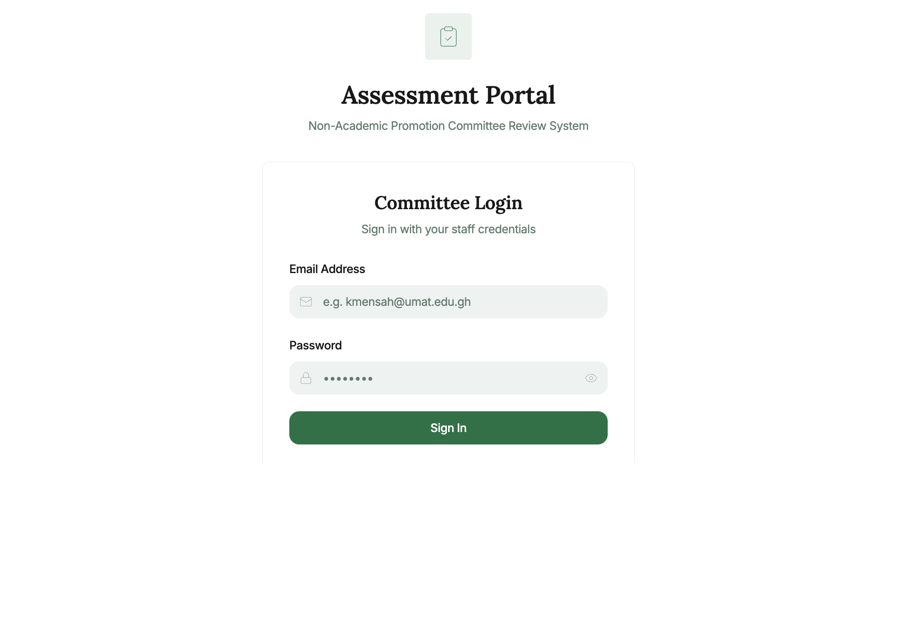
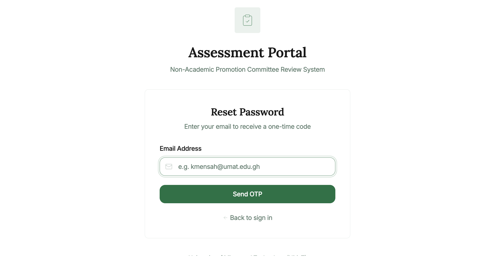
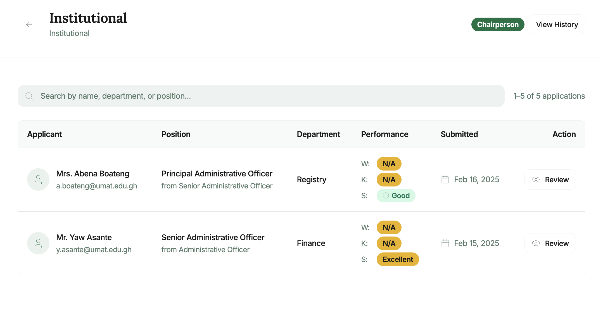
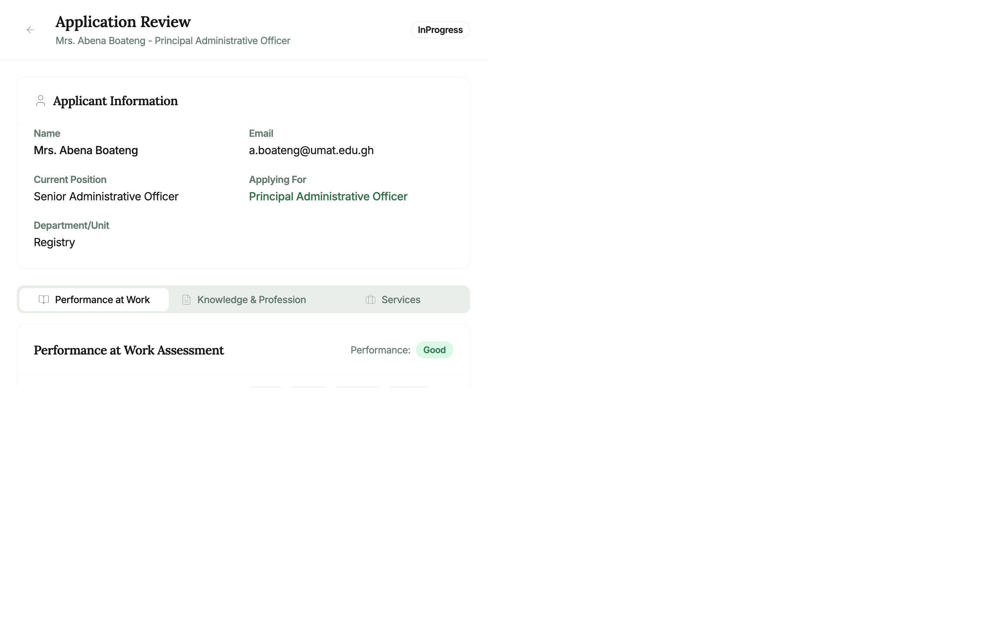
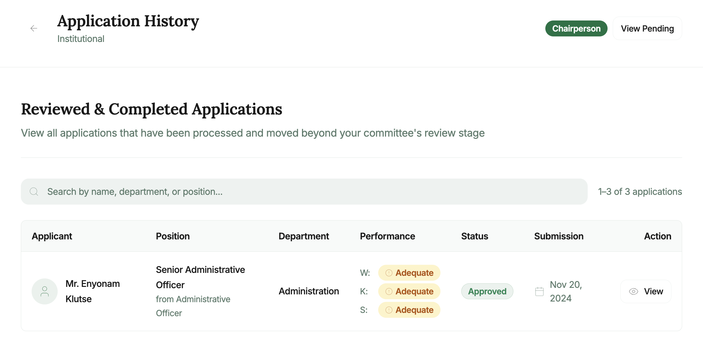
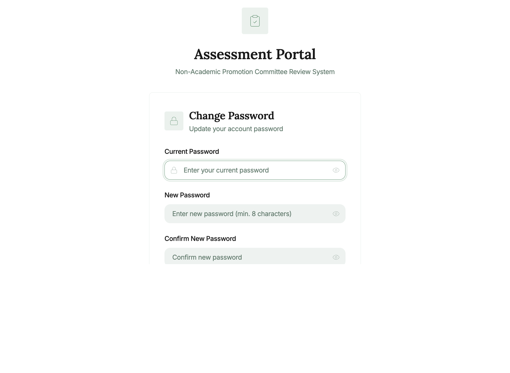

# OSASS Non-Academic Assessment Portal — User Manual

**System:** Online Staff Appointment & Promotion System (OSASS)  
**Portal:** Non-Academic Promotion Assessment Portal  
**Audience:** Non-academic staff serving on Non-Academic Promotion Assessment Committees (Institutional / University)  
**Version:** 1.0 | May 2025

---

## Table of Contents

1. [Overview](#1-overview)
2. [Getting Started](#2-getting-started)
   - [Logging In](#21-logging-in)
   - [Forgot Password](#22-forgot-password)
3. [Dashboard](#3-dashboard)
4. [Pending Applications](#4-pending-applications)
5. [Application Review](#5-application-review)
   - [Applicant Information](#51-applicant-information)
   - [Performance at Work Assessment Tab](#52-performance-at-work-assessment-tab)
   - [Knowledge & Profession Assessment Tab](#53-knowledge--profession-assessment-tab)
   - [Service Assessment Tab](#54-service-assessment-tab)
   - [Performance Overview Panel](#55-performance-overview-panel)
   - [Activity Timeline](#56-activity-timeline)
   - [Assessment Actions](#57-assessment-actions)
6. [Application History](#6-application-history)
7. [Account Management](#7-account-management)
   - [Change Password](#71-change-password)
8. [Navigation & Layout](#8-navigation--layout)
9. [Committee Roles & Permissions](#9-committee-roles--permissions)

---

## 1. Overview

The **OSASS Non-Academic Assessment Portal** is the dedicated review portal for non-academic staff who serve as members of Non-Academic Promotion Assessment Committees. These committees review and score promotion applications submitted by non-academic staff in the Non-Academic Promotion Portal.

The non-academic promotion review process involves two levels:

| Level | Committee | Scope |
|-------|-----------|-------|
| 1 | **Institutional Committee** (HOU / AAPSC) | Unit/section-level review |
| 2 | **University Committee** (UAPC) | University-level final review |

The **Chairperson** of each committee has the authority to advance applications to the next level, return them to the applicant for corrections, and — at the University Committee level — approve or reject applications.

**Key difference from the Academic Assessment Portal:** The three scored categories in this portal are **Performance at Work**, **Knowledge & Profession**, and **Service** (instead of Teaching, Publications, and Service).

---

## 2. Getting Started

### 2.1 Logging In

**Steps to log in:**

1. Navigate to the Non-Academic Assessment Portal URL.
2. Enter your **Staff Email** (e.g., `k.agyeman@umat.edu.gh`).
3. Enter your **Password**.
4. Click **Sign In**.

Successful login redirects to your **Dashboard**.

> **Note:** Access is restricted to staff registered as committee members in the Admin Portal. Contact the HR Office if you need access.

---

### 2.2 Forgot Password

1. Click **"Forgot password?"** on the login page.
2. Enter your registered email and click **Send OTP**.
3. Retrieve the one-time code from your email.
4. Enter the OTP, set a new password, and confirm.
5. Click **Back to sign in**.

---

## 3. Dashboard

The **Dashboard** displays your **committee assignments** as cards. Each card shows:

| Element | Description |
|---------|-------------|
| **Committee name** | e.g., "Institutional" or "University" |
| **Full committee title** | e.g., "Head of Unit Committee" or "University Assessment Committee" |
| **Chair badge** | Shown if you are the Chairperson |
| **Pending Applications** | Link with count badge |
| **View History** | Link to reviewed applications |

> **Example:** Mr. Kofi Agyeman, serving as Chairperson of the Institutional Committee, sees an "Institutional" card with a "Chair" badge and a pending applications count.

---

## 4. Pending Applications

**How to access:** Click **Pending Applications** on a committee card.

Lists all non-academic promotion applications forwarded to your committee for review.

**Table columns:**

| Column | Description |
|--------|-------------|
| **Applicant Name** | Full name of the non-academic staff member applying |
| **Current Position** | Applicant's current non-academic rank/grade |
| **Applying For** | Target promotion position |
| **Unit** | The applicant's home unit or section |
| **Submission Date** | Date the application was submitted |
| **Status** | Review status (Pending / In Progress) |
| **Resubmission indicator** | Badge if the application was previously returned |

**To search:** Use the search bar to filter by name or staff ID.

**To review an application:** Click anywhere on the application row.

---

## 5. Application Review

The **Application Review** page shows the full details of the non-academic promotion application with three assessment tabs corresponding to the three scoring categories.

### 5.1 Applicant Information

A card at the top of the page shows:
- **Name** and **Email**
- **Current Position** and **Applying For** (promotion target)
- **Unit** (the applicant's institutional unit or section)
- **Submission date** and current **Review Status** badge (e.g., *InProgress*)

---

### 5.2 Performance at Work Assessment Tab

The **Performance at Work** tab (active by default) shows the applicant's self-assessment across work performance categories.

**Assessment categories include** (subset shown depending on configuration):
- Quality of Work
- Punctuality & Regularity
- Knowledge of Procedures
- Ability to Work Independently
- Ability to Work Under Pressure
- Human Relations
- Initiative & Foresight
- Ability to Inspire and Motivate

**For each category:**
- Applicant's self-score and remarks (expand the row to view)
- Score input fields for each committee level (Institutional / University)
- Score badge indicators showing the score each committee has entered

**If you have assessment rights:**
1. Expand the category accordion row (click the row or `›` chevron).
2. In the score input panel for your committee level, enter a **numeric score**.
3. Add optional **remarks**.

---

### 5.3 Knowledge & Profession Assessment Tab

Click the **Knowledge** tab to review the applicant's qualifications and professional certifications.

**For each qualification/certificate item:**
- Title (e.g., *Master of Business Administration*)
- Year awarded and material type (e.g., *Master's Degree*, *Professional Certificate*)
- **System-Generated Score** (based on the knowledge material type's configured point value)
- Committee score badges (Institutional / University)
- Expand to enter your committee's assessment score

---

### 5.4 Service Assessment Tab

Click the **Service** tab to review the applicant's institutional service records.

**For each service record:**
- Service title, role, and duration
- System-generated score
- Committee score badges
- Expand to enter your assessment

---

### 5.5 Performance Overview Panel

On the **right side** of the review page, the **Performance Overview** panel summarises all scores:

| Category | Columns shown |
|----------|---------------|
| **Performance at Work** | SELF, Institutional (HOU), University (AAPSC/UAPC) totals |
| **Knowledge & Profession** | Same format |
| **Service** | Same format |

Each score box shows the numeric total and a **performance level label**:
- 🟢 **High** — Top performance range
- 🔵 **Good** — Second range
- 🟡 **Adequate** — Meets minimum
- 🔴 **Inadequate** — Below minimum

---

### 5.6 Activity Timeline

Scroll down the right panel to see the **Activity Timeline** — a chronological history of all events:
- Application submitted
- Received by Institutional Committee
- Any returns and resubmissions
- Committee score entries and advancements

---

### 5.7 Assessment Actions

**For non-chairperson committee members:**
- **Save Scores** — Save your entered scores without finalising the review

**For chairpersons (additional actions):**

| Action | Description |
|--------|-------------|
| **Save Scores** | Save the committee's full assessment |
| **Return to Applicant** | Return with written reason for correction |
| **Advance to University Committee** | Forward the reviewed application to the University-level committee |
| **Approve** (University Committee only) | Grant the promotion |
| **Reject** (University Committee only) | Reject with a written reason |

**How to advance an application:**
1. Ensure all scoring is complete.
2. Click **"Advance to University Committee"**.
3. Enter your recommendation in the dialog.
4. Click **Confirm**.

**How to return an application:**
1. Click **"Return to Applicant"**.
2. Specify the return reason and what corrections are needed.
3. Click **Confirm Return**.

---

## 6. Application History

**How to access:** Click **View History** on a committee card.

Shows all applications previously reviewed at this committee level, including:
- Applicant name and position
- Review outcome (Advanced / Approved / Rejected / Returned)
- Review date and performance scores

---

## 7. Account Management

### 7.1 Change Password

**How to access:** Click the user icon in the top right and select **Change Password**.

1. Enter your **Current Password**.
2. Enter and confirm your **New Password**.
3. Click **Update Password**.

---

## 8. Navigation & Layout

### Top Header Bar
- **Portal title** ("Assessment Portal") and subtitle ("Non-Academic Promotion Committee") on the left
- **Your name** in the top right

### Back Navigation
- A **back arrow (←)** on review and list pages returns you to the previous screen.

---

## 9. Committee Roles & Permissions

| Permission | Committee Member | Chairperson |
|------------|-----------------|-------------|
| View pending applications | ✅ | ✅ |
| View application review details | ✅ | ✅ |
| Enter assessment scores | ✅ | ✅ |
| Save score drafts | ✅ | ✅ |
| Return application to applicant | ❌ | ✅ |
| Advance to University Committee | ❌ | ✅ |
| Approve application (University) | ❌ | ✅ |
| Reject application (University) | ❌ | ✅ |
| View application history | ✅ | ✅ |

---

*For technical support: `support@umat.edu.gh`*  
*For committee assignment queries, contact the Human Resources / Non-Academic Promotion Office.*

---

*Document generated: May 2025 | OSASS v2*
