# OSASS Non-Academic Promotion Portal — User Manual

**System:** Online Staff Appointment & Promotion System (OSASS)  
**Portal:** Non-Academic Staff Promotion Portal  
**Audience:** Non-Academic Staff of the University of Mines and Technology (UMaT), Tarkwa  
**Version:** 1.0 | May 2025

---

## Table of Contents

1. [Overview](#1-overview)
2. [Getting Started](#2-getting-started)
   - [Logging In](#21-logging-in)
   - [Forgot Password](#22-forgot-password)
3. [Dashboard](#3-dashboard)
4. [Eligibility Check](#4-eligibility-check)
5. [Promotion Forecast](#5-promotion-forecast)
6. [Promotion Application](#6-promotion-application)
   - [Application Overview](#61-application-overview)
   - [Performance at Work Section](#62-performance-at-work-section)
   - [Knowledge & Profession Section](#63-knowledge--profession-section)
   - [Service Section](#64-service-section)
   - [Review & Submit](#65-review--submit)
7. [Application Progress Tracking](#7-application-progress-tracking)
8. [Promotion History](#8-promotion-history)
9. [Promotion Letter](#9-promotion-letter)
10. [Staff Updates](#10-staff-updates)
11. [Resources](#11-resources)
12. [Account Management](#12-account-management)
    - [Settings](#121-settings)
    - [Change Password](#122-change-password)
13. [Navigation & Layout](#13-navigation--layout)

---

## 1. Overview

The **OSASS Non-Academic Promotion Portal** is the dedicated web application for UMaT non-academic staff to apply for career promotion. It mirrors the Academic Portal in structure but is tailored to the specific scoring criteria and career path of non-academic roles — including administrative, technical, and support staff categories.

**Key capabilities:**
- Check promotion eligibility in real time
- Plan your career progression with the Promotion Forecast tool
- Build and submit a promotion application across three scored categories: Performance at Work, Knowledge & Profession, and Service
- Track the review progress through institutional review committees
- Download your official promotion letter upon approval

---

## 2. Getting Started

### 2.1 Logging In

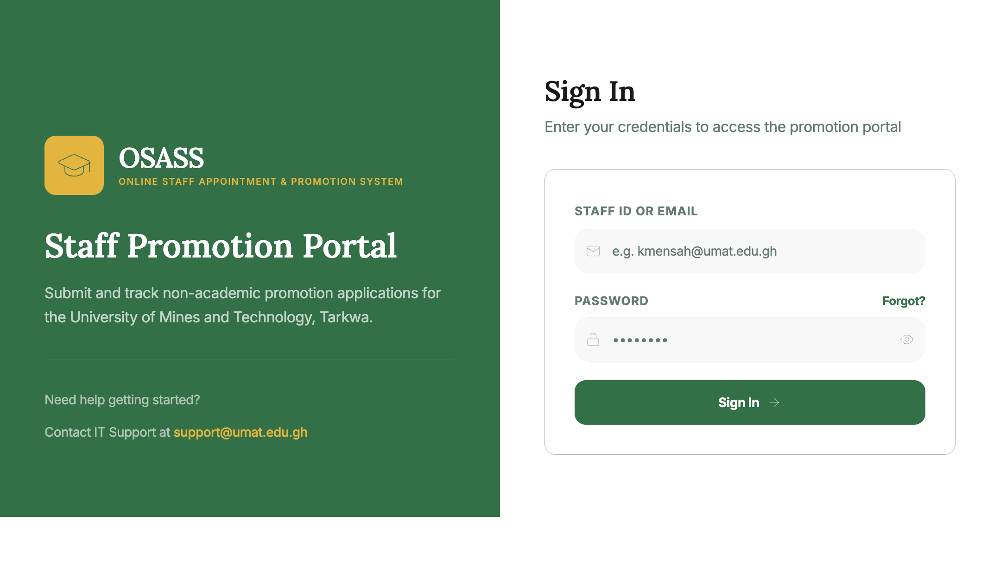

**Steps to log in:**

1. Navigate to the Non-Academic Portal URL. The **Sign In** page loads immediately.
2. Enter your **Staff ID or Email** (e.g., `a.boateng@umat.edu.gh`).
3. Enter your **Password**.
4. Click the **Sign In** button.

On a successful login, you will be redirected to the **Dashboard**.

> **Note:** If you have not received your credentials, contact the Human Resources Office or IT Support at `support@umat.edu.gh`.

---

### 2.2 Forgot Password

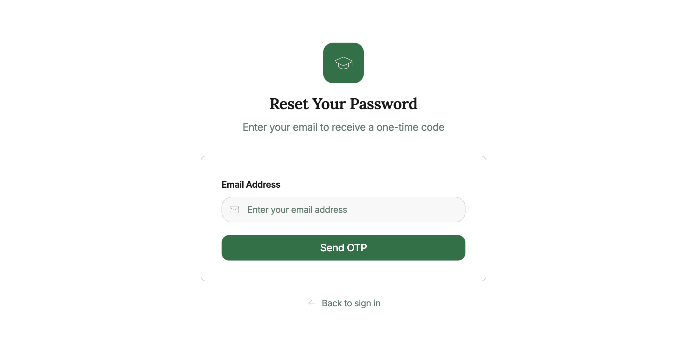

1. Click **"Forgot password?"** on the login page.
2. Enter your registered **Email Address** and click **Send OTP**.
3. Check your email for the one-time code.
4. Use the OTP and set a new password when prompted.
5. Click **Back to sign in** once complete.

---

## 3. Dashboard

The **Dashboard** is your central hub after signing in, providing an overview of your promotion status and quick access to all portal features.

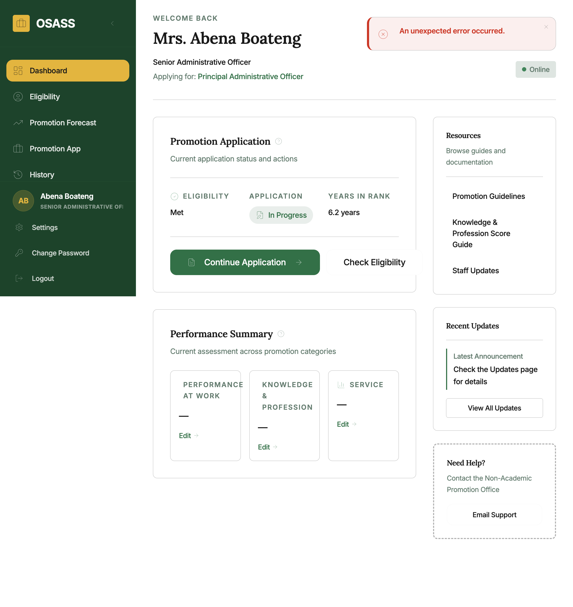

**Dashboard sections:**

| Section | Description |
|---------|-------------|
| **Welcome Back** | Your name, current position, and the target position you are applying for |
| **Promotion Application card** | Eligibility status, application status badge, and years in rank. Provides the primary action button (Start / Continue / View Status / View Letter) |
| **Performance Summary card** | Current scores across Performance at Work, Knowledge & Profession, and Service with quick "Edit" links |
| **Resources panel** | Quick links to Promotion Guidelines, Score Guide, and Staff Updates |
| **Recent Updates** | Preview of the latest staff announcement |
| **Need Help?** | Contact details for the Non-Academic Promotion Office |

**First-time onboarding:** A **Welcome to OSASS** banner appears on first login explaining the portal's three key actions. Click **"Got it, let me explore"** to dismiss it.

---

## 4. Eligibility Check

Before starting an application, verify that you meet all promotion criteria on the **Promotion Eligibility Assessment** page.

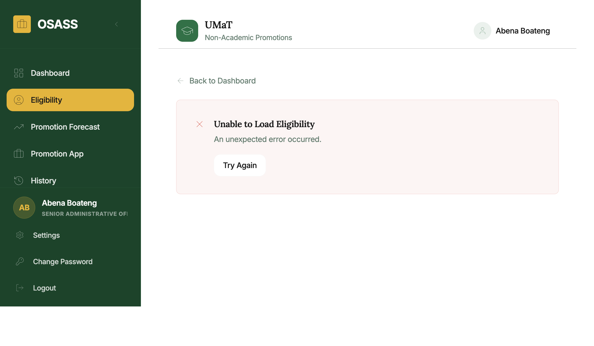

**How to access:** Click **Eligibility** in the left sidebar.

**What the page shows:**

| Section | Description |
|---------|-------------|
| **Overall status banner** | Green (Eligible) or Amber (Action Required) with a summary message |
| **Years in Current Rank** | Progress bar showing years served vs. minimum required (e.g., *6.2 / 5* means 6.2 years against a 5-year minimum — requirement **met**) |
| **Performance Requirements** | Submitted performance levels across Performance at Work, Knowledge, and Service; indicates whether the required performance combination has been achieved |
| **Knowledge Requirements** | Whether minimum qualifications or certificates have been submitted |

**What to do:**
- If **Eligible**: Proceed to start or continue your application.
- If **Not Eligible**: Review which specific criteria are unmet and update the relevant sections of your application profile.

---

## 5. Promotion Forecast

The **Promotion Forecast** tool shows your complete non-academic career promotion path and helps you plan for future milestones.

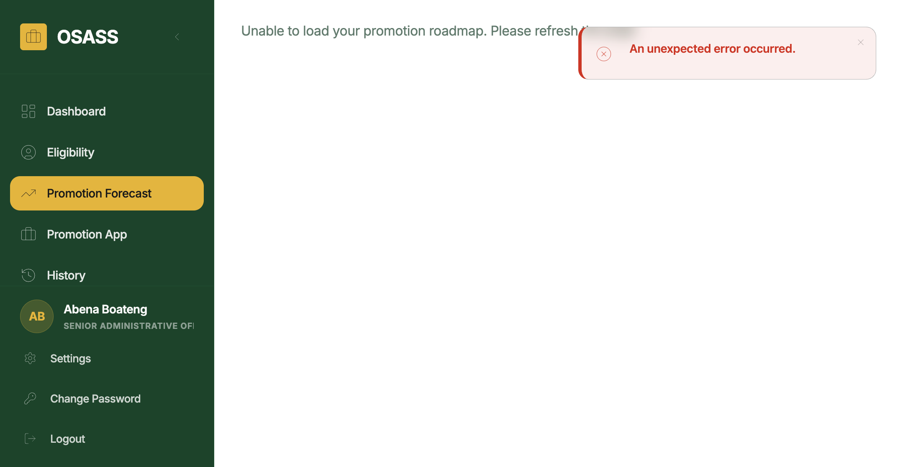

**How to access:** Click **Promotion Forecast** in the sidebar.

**What the page shows:**

- Your current position and date of last promotion
- For each career milestone:
  - Target position and eligibility status
  - Years required vs. years served
  - Estimated eligibility date for future milestones
  - A prioritised list of **required actions** (e.g., *"Document your service activities"*, *"Obtain a professional certificate"*)
  - Any performance gap analysis (current vs. required scores)
- Future milestones are shown as **locked** until intermediate promotions are completed

---

## 6. Promotion Application

The non-academic promotion application consists of three scored sections. All sections must be completed before the application can be submitted.

### 6.1 Application Overview

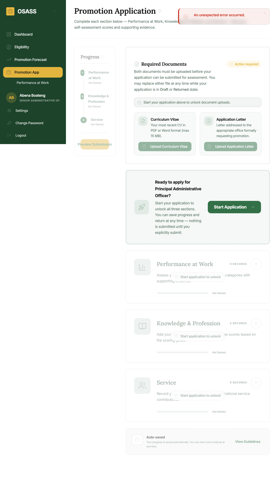

**How to access:** Click **Promotion App** in the sidebar or **"Continue Application"** on the dashboard.

The overview displays three category cards:

| Category | Max Score | Description |
|----------|-----------|-------------|
| **Performance at Work** | 60 | Ratings from supervisors on work quality, efficiency, attendance, and attitude |
| **Knowledge & Profession** | 30 | Academic qualifications, professional certifications, and training completions |
| **Service** | 20 | Institutional service roles performed within UMaT |

Click any card to enter that section.

---

### 6.2 Performance at Work Section

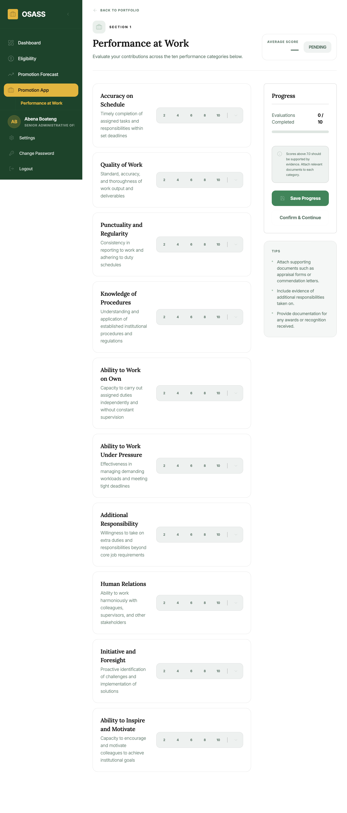

**How to access:** Click the **Performance at Work** card or navigate via **Promotion App → Performance at Work**.

**What to do in this section:**
1. **Add performance ratings** for each assessment year within the promotion period:
   - Select the **category** (e.g., Efficiency, Punctuality, Teamwork)
   - Select the **rating** (Excellent, Good, Satisfactory, Poor)
   - Enter the **year** and **name of rater** (supervisor/HOD)
2. **Upload the performance appraisal document** (official annual appraisal forms signed by your supervisor).
3. Click **Save** after each entry.
4. Click **Mark as Complete** when all ratings are entered.

The system aggregates performance ratings into a numeric score based on the institutional scoring matrix.

---

### 6.3 Knowledge & Profession Section

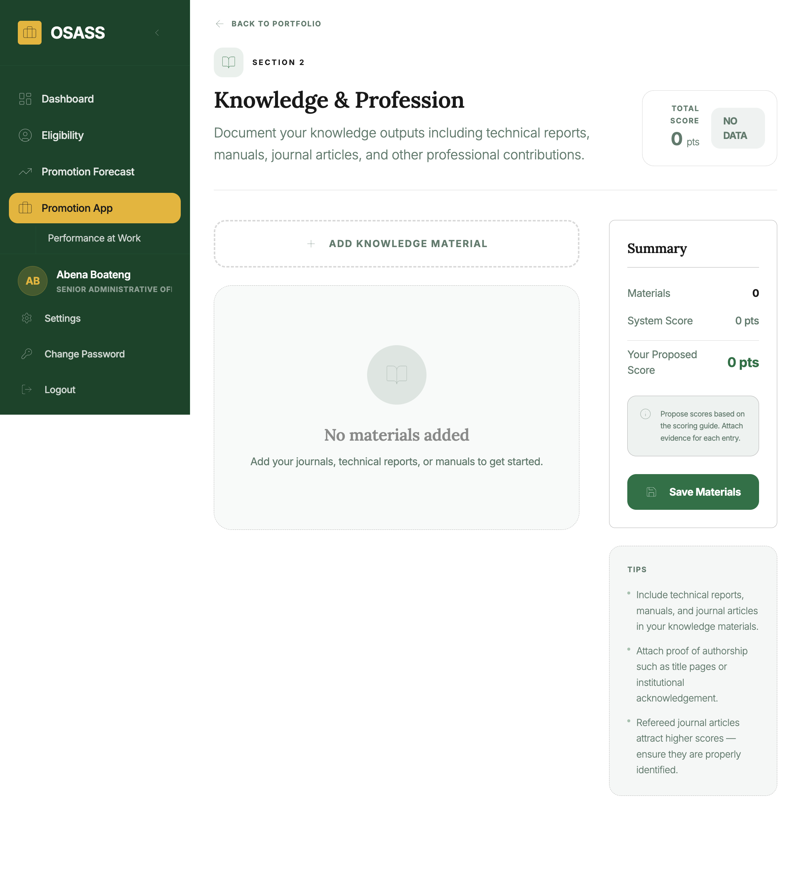

**How to access:** Click the **Knowledge & Profession** card or navigate via **Promotion App → Knowledge & Profession**.

**What to do in this section:**
1. **Add qualifications and certifications** obtained during the assessment period:
   - Select the **type** from the dropdown (e.g., *Master's Degree*, *Professional Certificate*, *Training Course*)
   - Enter the **name of the qualification/certificate**
   - Enter the **awarding institution** and **year awarded**
2. **Upload supporting documents** (degree certificates, transcripts, course completion letters).
3. Click **Save** for each entry.

Each knowledge material type carries a score defined by the administration. For example, a Master's Degree may carry 10 points while a professional certificate carries 5 points.

---

### 6.4 Service Section

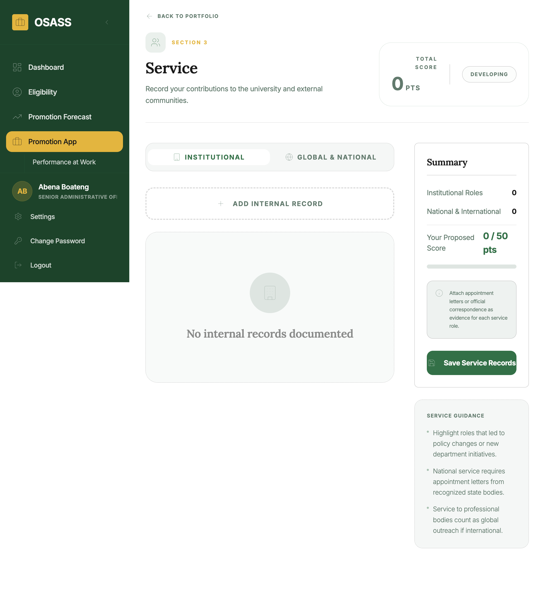

**How to access:** Click the **Service** card or navigate via **Promotion App → Service**.

**What to do in this section:**
1. **Add service roles** performed at UMaT:
   - Select the **position type** (e.g., *Head of Unit*, *Secretary to Committee*, *Sports Coordinator*)
   - Enter the **period** of service (start and end dates)
   - Add any supporting **remarks**
2. **Upload a service document** if available.
3. Click **Save** and **Mark as Complete** when all roles are entered.

---

### 6.5 Review & Submit

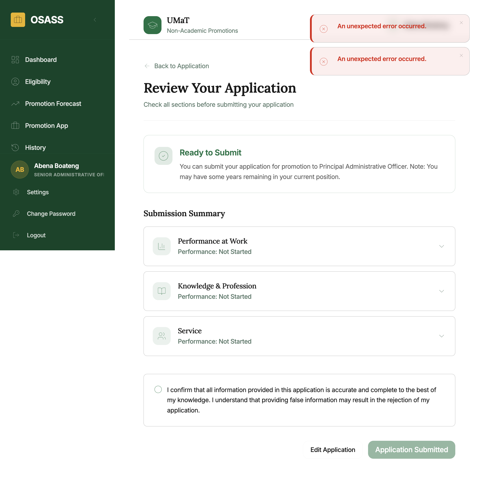

**How to access:** Navigate to the **Review** page once all three sections show **Completed** status.

**What the Review page shows:**
- A summary of all three sections with scores and completion status
- The overall score vs. the passing threshold
- A checklist verifying all required documents are uploaded

**Submitting:**
1. Review all information carefully — the application **cannot be edited after submission**.
2. Click **Submit Application** and confirm in the dialog.
3. You will receive a confirmation and be redirected to the Progress page.

---

## 7. Application Progress Tracking

After submission, track your application through the institutional review pipeline.

**How to access:** Click **"View Application Status"** on the dashboard or navigate to `/progress`.

The progress page shows each review stage:

| Stage | Description |
|-------|-------------|
| **Submitted** | Application received |
| **Under Review (Institutional Committee)** | Committee is reviewing |
| **Under Review (University Committee)** | University-level review in progress |
| **Approved / Rejected / Returned** | Final decision |

If **Returned**, the committee's notes for correction will be shown and you can resubmit after making the required changes.

---

## 8. Promotion History

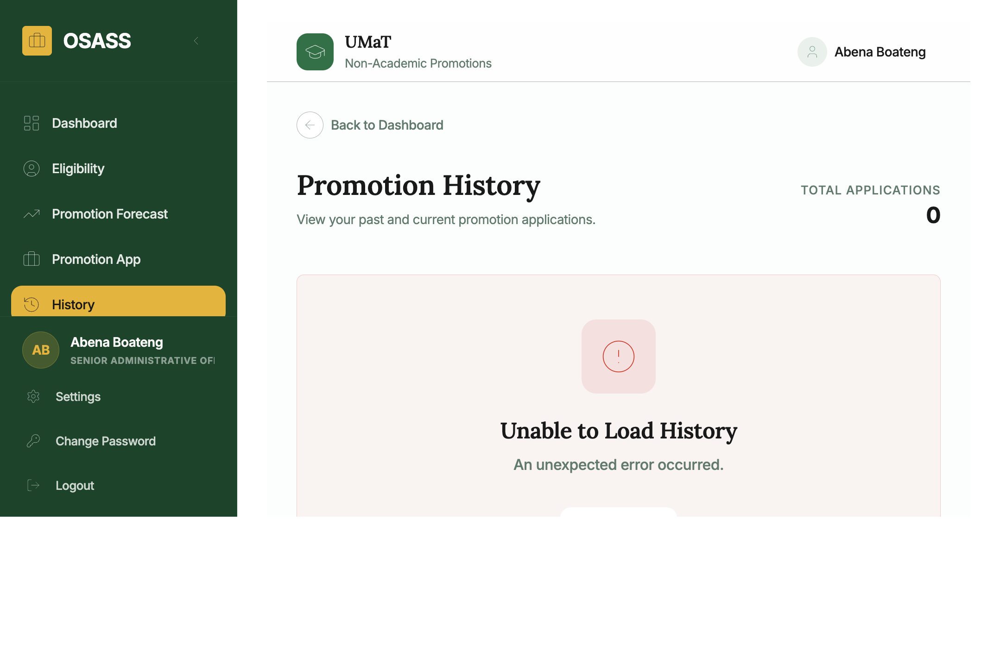

**How to access:** Click **History** in the left sidebar.

Shows a complete record of all past promotion applications including:
- Year, from/to positions, outcome status
- Date submitted and date of decision
- Total score achieved per cycle

---

## 9. Promotion Letter

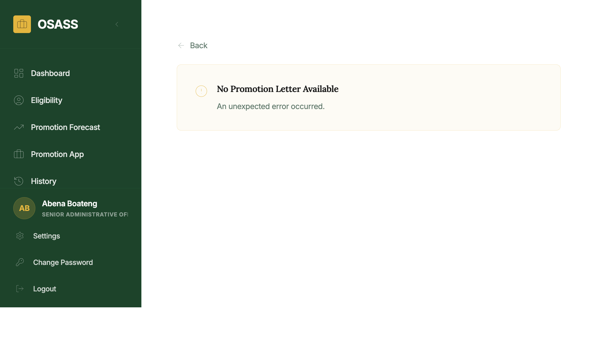

**How to access:** Click **Promotion Letter** in the sidebar (only active after an approved application).

Displays your official **promotion letter** showing:
- Full name and staff ID
- Promotion from/to position and effective date
- Reference number and approving authority

Use the action buttons to **print** or **download as PDF**.

---

## 10. Staff Updates

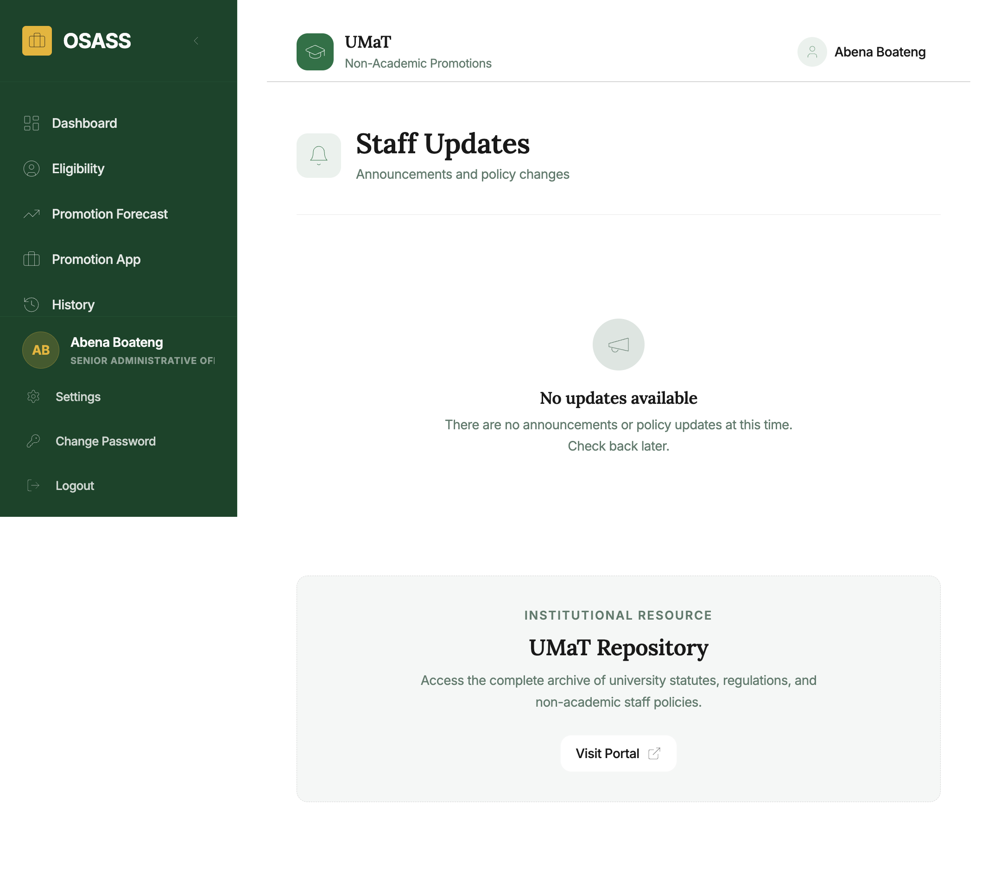

**How to access:** Access via the sidebar or the Resources panel on the dashboard.

Shows institutional announcements and notices from the HR / Promotion Office. Use the **search bar** to find specific updates. Updates are paginated.

---

## 11. Resources

Navigate to the **Guidelines** page for the official UMaT non-academic promotion criteria, scoring methodology, and required documentation.

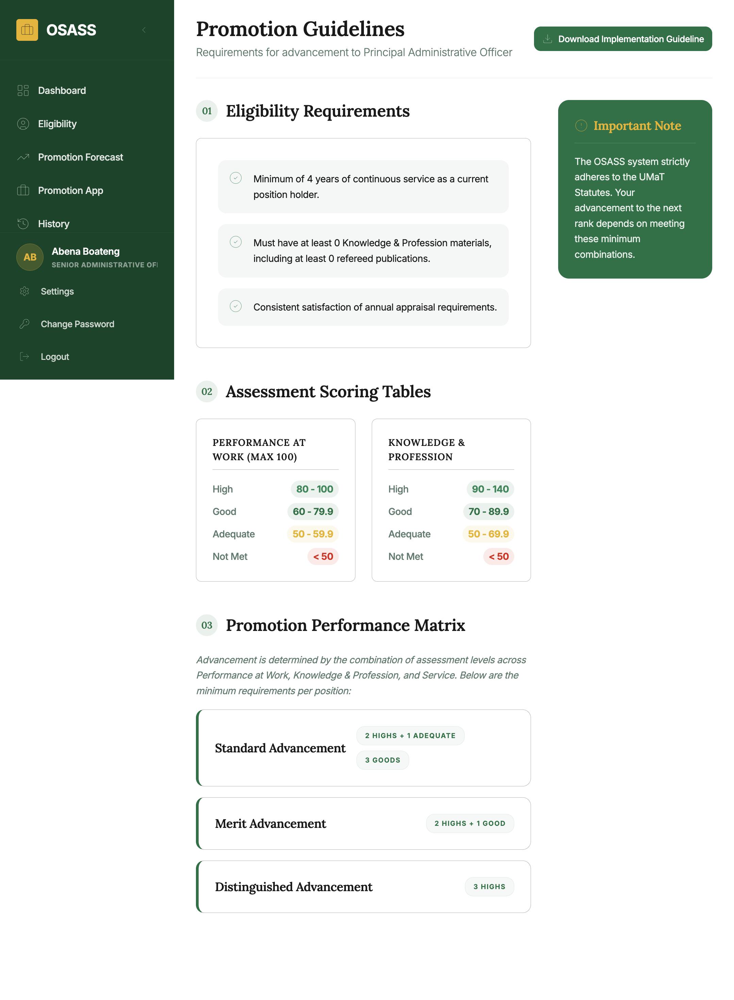

The guidelines explain:
- Position levels and minimum years for each
- Performance rating score mapping
- Knowledge material indicator scores
- Service role score values

---

## 12. Account Management

### 12.1 Settings

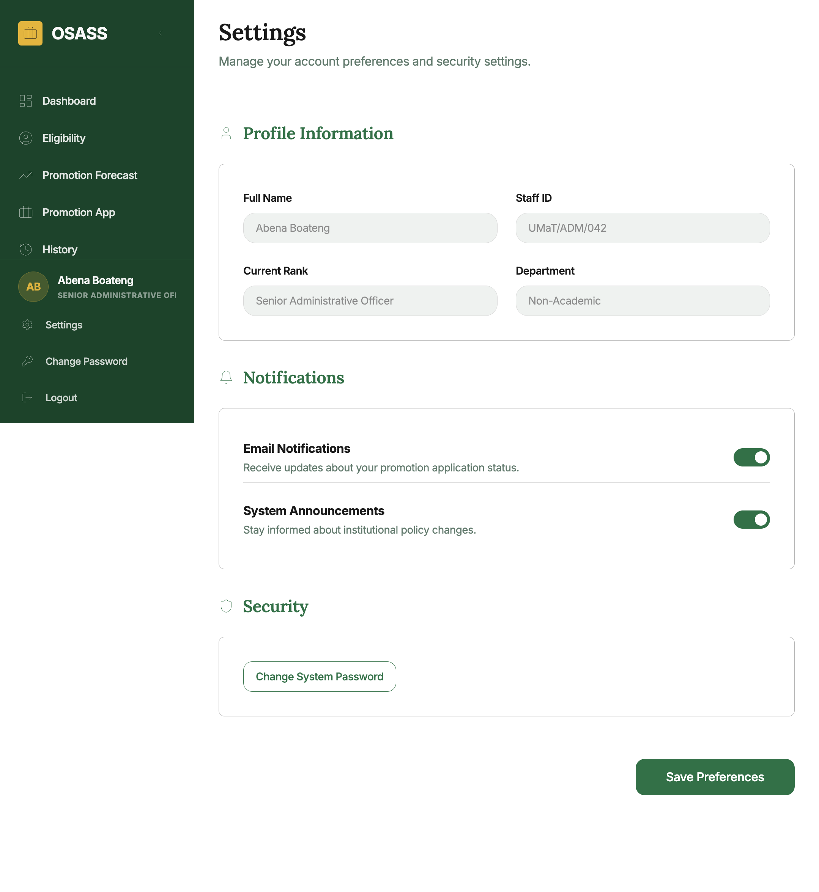

**How to access:** Click **Settings** in the sidebar footer.

Allows you to toggle between **Light** and **Dark** display themes.

### 12.2 Change Password

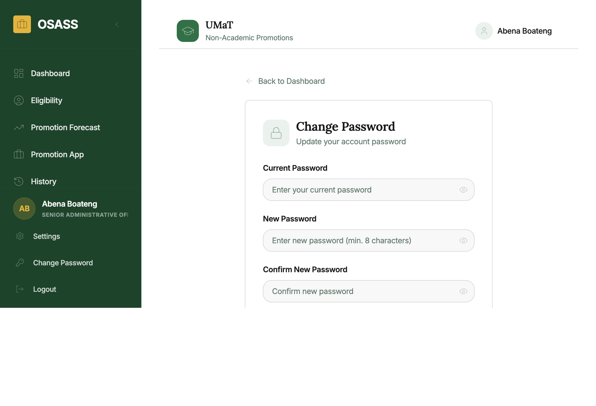

**How to access:** Click **Change Password** in the sidebar footer.

1. Enter your **Current Password**.
2. Enter and confirm your **New Password** (min. 8 characters).
3. Click **Update Password**.

---

## 13. Navigation & Layout

### Left Sidebar

| Item | Description |
|------|-------------|
| OSASS logo + collapse toggle | Collapse sidebar to icon-only view |
| **Dashboard** | Home page |
| **Eligibility** | Eligibility assessment |
| **Promotion Forecast** | Career path planner |
| **Promotion App** | Application sections (Performance at Work, Knowledge & Profession, Service) |
| **History** | Past promotion records |
| User profile card | Name and current position |
| **Settings** | Theme preferences |
| **Change Password** | Password management |
| **Logout** | Secure sign-out |

### Top Header Bar
- **Portal identifier** (UMaT logo + "Non-Academic Promotions")
- **Your name** shown on the right

---

*For technical support: `support@umat.edu.gh`*  
*For promotion queries: contact the Human Resources / Non-Academic Promotion Office.*

---

*Document generated: May 2025 | OSASS v2*
